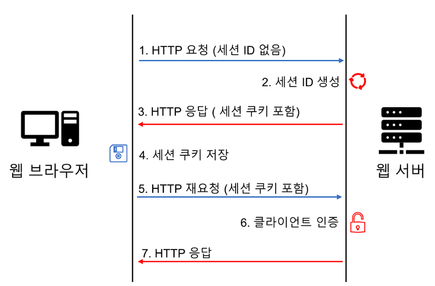

# HTTP & HTTPS
## HTTP

### 정의

- HyperText Transfrer Protocol
- 주로 HTML과 같은 HyperText 문서를 주고 받기 위해 만들어짐
- OSI 7계층 중 7층 응용 계층에 해당하는 프로토콜

### 특성

- **Client-Server 구조**
    - Client-Server 구조에서 각각의 서버와 클라이언트는 독립되어 있음
    - 클라이언트는 서버에 요청(Request)를 보내고 응답이 올 때 까지 대기
    - 서버는 클라이언트에서 받은 요청에 대한 결과를 만들어 응답
    - 서버에서 비즈니스 로직과 데이터를 Client에 독립적으로 처리할 수 있도록 만든 구조

- **비연결성(Connectionless)**
    - 클라이언트와 서버가 한 번 연결을 맺은 후, 클라이언트 요청에 대해 서버가 응답을 마치면 맺었던 연결을 끊어버리는 성질
    - 장점 : 불필요한 연결을 하지 않아 서버 유지 자원을 효율적으로 사용 가능
    - 단점 : 서버는 클라이언트를 기억하지 않으므로 동일한 클라이언트의 모든 요청에 대해 매번 새로운 연결을 시도하거나 해제하는 과정을 거쳐야 함 → 연결/헤제에 대한 오버헤드 발생
        - KeepAlive 속성을 통해 오버헤드를 줄이려고 함
            - 지정된 시간동안 서버와 클라이언트 사이에서 패킷 교환이 없을 경우, 클라이언트가 살아있는지 확인하기 위해 작은 패킷을 주기적으로 보냄
            - 이때 패킷에 반응이 없으면 접속을 끊게 됨

- **무상태(Stateless)**
    - 비연결성으로 인해 서버는 클라이언트를 식별할 수 없음을 뜻함. 클라이언트의 상태를 모름
        - ex) 쇼핑몰의 경우 물건을 구매할 때 화면이 넘어갈 때마다 로그인을 해주어야 함
    - 상태를 기억하는 법
        - 쿠키
            - 서버가 사용자의 웹 브라우저에 전송하는 작은 데이터 조각
            - 세션 관리, 개인 설정 유지, 사용자 트래킹 용도로 사용됨
            - 웹 브라우저가 종료되거나 만료날짜가 있을 경우 만료일이 되면 삭제됨
            - 사용자 정보가 브라우저에 저장되어 위변조의 가능성이 높아 보안에 취약함
            - 쿠키 작동 방식
            
            
            
        - 세션
            - 서버에 세션에 대한 정보를 저장해놓고 세션 쿠키를 클라리언트에게 주어 클라이언트를 식별할 수 있도록 하는 방식
            - 웹 브라우저가 종료되면 세션 쿠키는 삭제됨
            - 정보가 서버에 저장되기 때문에 쿠키보다는 안전하지만 중간에 탈취당할 수 있기 때문에 보안에 완벽하지 않음
            - 세션 작동 방식
            
            
            
        - 토큰을 사용하는 OAuth, JWT
            - 보호할 데이터를 토큰으로 치환하여 원본 데이터 대신 토큰을 사용하는 기술
            - 중간에 토큰이 탈취당하더라도 데이터에 대한 정보를 알 수 없어 보안성이 높음
            - OAuth
                - 자신의 애플리케이션에서 사용자 인증을 하기 위해 다른 애플리케이션의 사용자 인증방식을 하도록 인가하는 방식 → 인가 프로토콜
                - 동작 방식
                
                
                
            - JWT(JSON Web Token)
                - 토큰 자체가 의미를 갖는 Claim 기반의 토큰을 가지고 인증하는 방식
                - Claim(권한) : 사용자에 대한 프로퍼티나 속성
                - 작동 방식
                    1. JSON 객체에 요구사항을 작성
                    2. 어떠한 암호화 방식을 사용해서 문자열로 인코딩
                    3. HTTP header에 추가해 사용자 인증을 요청
                    4. 서버에서는 Header에 추가된 Token을 디코딩하여 사용자를 인증
                - 권한을 부여하기 위해 필요한 데이터가 JWT 안에 모두 담겨있어 OAuth처럼 인증 서버에서 토큰에 대한 정보를 찾을 필요가 없음

### 구조

- 요청 메세지 : start-line, header, empty-line, body로 구성
    - start-line : 어떤 요청을 하는지에 대한 내용을 기술 (HTTP METHOD, URL, protocol version)
        - HTTP METHOD : GET, POST, PATCH, PUT, DELETE와 같은 http method를 적는 부분
        - URL : 리소스를 요청하는 주소
        - protocol version : http의 버전을 의미, HTTP/2를 주로 사용
    - header : 요청에서 필요한 다양한 요소를 담을 수 있는 공간. key와 value로 구성
        - Content-Type : Body에 들어가는 요청 전문의 Type
        - Accept : 응답 받을 메세지 타입
        - connectioin : 연결 설정. 주로 keep-alive로 셋업
    - empty-line : Header와 body를 구분하는 부분
    - Body : 메세지 전문이 들어감. Content-Type과 꼭 Type를 맞춰주어야 함
- 응답 메세지 : 전체 구조는 요청과 똑같음
    - start-line : protocol version, Http Status code, Http Status가 담겨있음
        - Http Status code : 클라이언트가 서버에 요청을 했을 때, 서버가 숫자로 반환한 요청에 대한 처리 상태
            
            [HTTP 상태 코드](https://ko.wikipedia.org/wiki/HTTP_상태_코드)
            
            | 상태 코드 | 의미 |
            | --- | --- |
            | 100-109 | 메시지 정보 |
            | 200-206 | 요청 성공 |
            | 300-305 | 리다이렉션 |
            | 400-415 | 클라이언트 에러 |
            | 500-505 | 서버에러 |
    - header : 요청과 유사하나 서버에 대한 정보를 전달. 사용자의 cookie나 session을 초기화하는 데에도 이용됨

## HTTPS

### 정의

- HyperText Transfer Protocol Secure
- 웹 브라우저와 웹사이트 사이에서 통신을 암호화해 안전한 연결을 제공하는 프로토콜
- HTTP의 확장 버전, 더 안전한 버전
- HTTPS는 HTTP 요청 및 응답을 SSL 및 TLS 기술에 결합

### 작동 방식

1. 사용자 브라우저의 주소 표시줄에 *https://URL* 형식을 입력하여 HTTPS 웹 사이트를 방문
2. 브라우저는 서버의 SSL 인증서를 요청하여 사이트의 신뢰성을 검증하려고 시도
3. 서버는 퍼블릭 키가 포함된 SSL 인증서를 회신으로 전송
4. 웹 사이트의 SSL 인증서는 서버 아이덴티티를 증명. 브라우저에서 인증되면 브라우저가 퍼블릭 키를 사용하여 비밀 세션 키가 포함된 메세지를 암호화하고 전송
5. 웹 서버는 개인 키를 사용하여 메세지를 해독하고 세션 키를 검색한 뒤 세션 키를 암호화하고 브라우저에 승인 메세지를 전송
6. 브라우저와 웹 서버 모두 동일한 세션 키를 사용하여 메세지를 안전하게 교환하도록 전환

## HTTP와 HTTPS 비교

|  | HTTP | HTTPS |
| --- | --- | --- |
| 의미 | Hypertext Transfer Protocol | Hypertext Transfer Protocol Secure |
| 기본 프로토콜 | HTTP/1과 HTTP/2는 TCP/IP를 사용, HTTP/3은 QUIC 프로토콜을 사용 | HTTP 요청 및 응답을 추가로 암호화하기 위해 SSL/TLS와 함께 HTTP/2 사용 |
| 포트 | 기본 포트 80 | 기본 포트 443 |
| 용도 | 이전 텍스트 기반 웹 사이트 | 모든 최신 웹 사이트 |
| 보안 | 추가 보안 기능 없음 | 퍼블릭 키 암호화에 SSL 인증서 사용 |
| 이점 | 인터넷을 통한 통신 지원 | 웹 사이트에 대한 권위, 신뢰성 및 검색 엔진 순위 개선 |

---

## 질문

1. HTTP는 OSI 7 계층중 어디에 해당하는가?
2. HTTP의 특성 세 가지는?
3. HTTPS는 HTTP에 어떤 기술에 결합하였는가?

## 출처

https://aws.amazon.com/ko/compare/the-difference-between-https-and-http/

https://victorydntmd.tistory.com/286

[https://velog.io/@couchcoding/HTTP에-대해서-알아보자정의와-구조](https://velog.io/@couchcoding/HTTP%EC%97%90-%EB%8C%80%ED%95%B4%EC%84%9C-%EC%95%8C%EC%95%84%EB%B3%B4%EC%9E%90%EC%A0%95%EC%9D%98%EC%99%80-%EA%B5%AC%EC%A1%B0)

https://noahlogs.tistory.com/38
