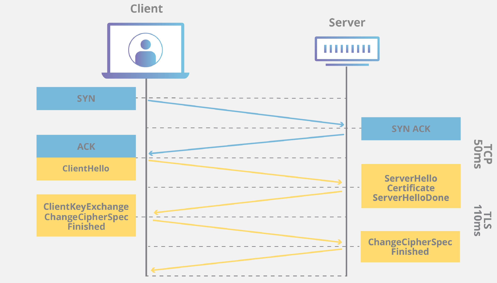

# TLS & SSL HandShake

## TLS/SSL이란?

SSL(Secure Sockets Layer)은 보안 프로토콜로서, 개인정보 보호, 인증, 무결성 을 인터넷 통신에 제공한다.
SSL 이란 명칭은 TLS(Transport Layer Security)로 발전했다.
SSL/TLS 를 사용하는 웹사이트의 URL에는 "HTTP" 대신 "HTTPS" 가 있다.

> SSL 이 발전되어 TLS 이라는 용어로 변경되었지만 SSL 의 인지도가 크기 때문에 현재까지 TLS 도 SSL 로 부르며 사용한다고 한다.
> 소유권 변경을 위해 TLS 라는 이름으로 변경 되었을 뿐 SSL 의 최종 버전(3.0) 과 TLS 첫 버전의 차이는 크지 않다.

## TLS/SSL의 역할

- 암호화 : 제3자로부터 전송되는 데이터를 숨긴다.
- 인증 : 정보를 교환하는 당사자가 요청된 당사자임을 보장한다.
- 무결성 : 데이터가 위조되거나 변조되지 않았는지 확인한다.

## TLS & SSL HandShake

> 파란색 부분: `3-way handshake`  
> 주황색 부분: `TLS handshake`

TLS 연결은 `TLS HandShake`를 사용하는데 사용자가 TLS를 사용하는 웹 사이트를 접속하면 클라이언트와 웹 서버간에 `TLS HandShake`가 시작된다.

클라이언트는 서버의 인증서를 받아 무결성을 확인하고 신뢰할 수 있는 서버라면 암호화 통신에 사용할 대칭키를 서버의 공개키로 암호화하여 전달한다.

여기서 데이터를 주고 받기 전에 **서버의 무결성을 확인하고 대칭키를 전달하는 과정**이 `TLS HandShake`이다.

1.  Cilent : Client Hello  
    클라이언트가 서버에서 `Client Hello` 메시지 전송  
    패킷 내에는 **TLS Version**, **암호 알고리즘** 이 담겨있음.

2.  Server : Server Hello  
    클라이언트가 보낸 `Client Hello`에 대한 서버의 응답
    TLS Version, 암호화 방식(Client가 보낸 암호화 방식 중, 서버가 사용 가능한 암호화 방식을 선택),
    Server Random Data(서버에서 생성한 난수, 대칭키를 만들 때 사용), Session ID(유효한 ID)

3.  Server : Server Certificate  
    서버의 인증서를 클라이언트에 보내는 단계(필요에 따라 CA의 Certificate도 함꼐 전송)
    클라이언트는 이 패킷을 통해 서버의 인증서가 무결한지 검증
4.  Server : Server Hello Done
    서버가 클라이언트에게 보낼 메세지를 모두 보냈다는 뜻

5.  Client : Client Key Exchange  
    인증서가 무결한지 검증 되었으면 클라이언트의 난수와 서버의 난수를 조합하여 대칭키 생성
    생성한 대칭키를 서버의 공개키로 암호화
    암호화한 정보를 서버에게 전송

    > 키 교환에 필요한 정보를 서버에 제공 -> 이 정보를 pre-master secret(난수를 조함하여 생성)이라고 하며 대칭키에 사용되는 것으로 정대 노출이 되어서는 안됨
    > 이 값을 서버의 공개키로 암호화하여 전송 -> 서버는 개인키로 복호화 가능 => 서로가 pre-master secret 공유 -> 이 값을 사용하여 세션에 사용될 키 생성하는데 이 키가 바로 대칭키

6.  Server & Clinet : Change Cipher Spec  
    이제부터 전송되는 모든 패킷을 협상된 알고리즘과 키를 이용하여 암호화 하겠다고 알리는 메세지

7.  Server & Client : Finished  
    TLS HandShake를 성공적으로 마치고 종료
