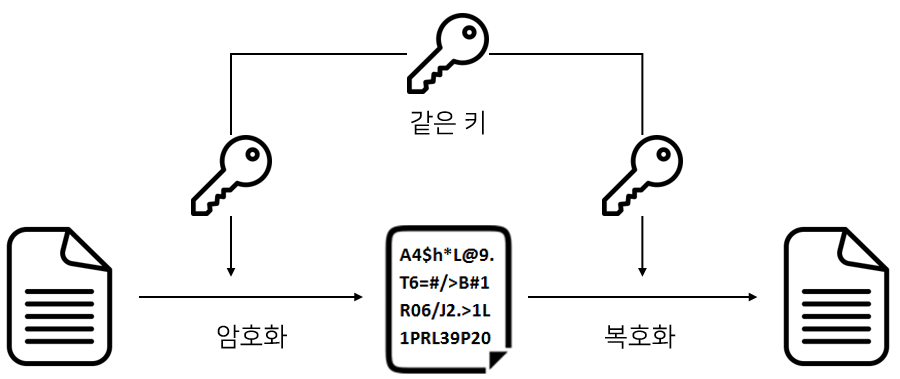
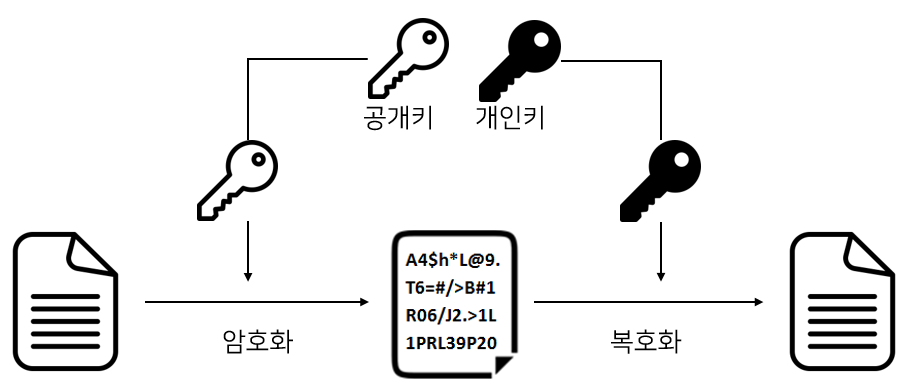
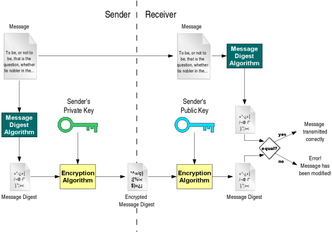

# 대칭키 & 공개키

**대칭키 vs 공개키(비대칭키)**

대칭키 암호화 방식 : 암복호화에 사용하는 키가 동일함  
공개키 암호화 방식 : 암복호화에 사용하는 키가 서로 다르며 비대칭키 암호화라고도 함

### 용어

    •	기밀성(Confidentiality): 정보에 대한 무단 접근을 방지하여 허가된 사람만 볼 수 있도록 함.
    •	무결성(Integrity): 정보가 무단으로 변경되거나 손상되지 않도록 보장함.
    •	인증(Authentication): 사용자의 신원을 확인하여, 정보나 시스템에 접근할 자격이 있는지 검증함.
    •	부인 방지(Non-repudiation): 정보 송수신자가 자신의 행위를 나중에 부인하지 못하도록 기록을 보장함 (주로 디지털 서명 사용).

## 대칭키

대칭키 암호화 방식은 암호화와 복호화에 사용되는 키가 동일한 암호화 방식을 말한다. 암호화와 복호화에 쓰는 키가 동일하기 때문에 대칭키를 사용한다고 말한다. 대칭키를 가진 사람은 암호화와 복호화를 할 수 있다.

**장점 : 암호화방식에 속도가 빠르다. 대용량 Data 암호화에 적합하다.**  
**단점 : 키를 배송 문제, 탈취 관리 걱정, 사람이 증가할수록 키관리가 어려워짐, 확장성 떨어짐**

키 배송 문제 해결방법: 키의 사전 공유에 의한 해결, 키 배포센터에 의한 해결, 공캐키 암호에 의한 해결 등이 있다.

Session Key, Secret Key, Shared Key, 대칭키, 단용키라고도 함

기밀성을 제공하나, 무결성/인증/부인방지 를 보장하지 않음

대표적 알고리즘 : 공인인증서의 암호화방식으로 유명한 SEED, DES, 3DES, AES, ARIA, 최근 주목받고 있는 암호인 ChaCha20

## 공개키

공캐키 암호화 방식은 대칭키 암호화 방식의 키 배송 문제를 극복하기 위해 등장했다. 공개키 암호화 방식은 암호화와 복호화에 사용되는 키가 다른 암호화 방식을 말하며 서로 다른 두개의 키인 `공개키(Public Key)`와 `개인키(Private Key)`를 사용한다.

**공개키로 암호화한 암호문은 오직 개인키로만 복호화 할 수 있다.**

> - 공개키(Public Key) : 배포해도 되는 키
> - 개인키(Private Key) : 절대로 유출해서는 안되는 키

**단점 : 속도가 느림**  
**장점 : 키분배 필요 X, 기밀성/인증/부인방지 기능 제공**

**동작 과정 (단방향)**

1. 나에게 암호문을 전달하고 싶은 대상에게 공개키를 전달한다. (공개키는 바로 네트워크를 통해 전달해도 된다.)
2. 공개키를 받은 사람은 공개키를 사용하여 암호화하고 나에게 암호문을 보낸다. 이제 암호문을 복호화 할 수 있는 건 비밀키를 가진 '나' 뿐이다.
3. 나는 암호문을 받아 비밀키로 복호화한다.
4. 위 동작 과정에서 '나'는 오직 암호문을 복호화할뿐이다. 나도 암호문을 보내고 싶다면 어떻게 할까? 즉 A와 B가 서로 암호문을 주고 받는 동작 과정은 아래와 같다.

**동작 과정 (양방향)**

1. A와 B는 각자 개인키와 공개키를 가지고 있다.
2. A는 B에게 자신의 공개키를, B도 A에게 자신의 공개키를 전달한다.
3. 상대방에게 전달받은 공개키로 암호화해 암호문을 보낸다. 즉 A는 B의 공개키로 암호화하고 B는 A의 공개키로 암호화한다. 이제 암호문을 복호화 할 수 있는건 비밀키를 가진 '상대방' 뿐이다.
4. 암호문을 받으면 자신의 비밀키로 복호화한다.

- 대표적인 알고리즘
  - Diffie Hellman : 최초의 공개키 알고리즘, 위조에 취약
  - RSA : 대표적 공개키 알고리즘
  - DSA : 전자서명 알고리즘 표준
  - ECC : 짧은 키로 높은 암호 강도, 빠른 구현 가능 PDA, 스마트폰등에 사용

### 대칭키와 공개키의 혼합

1. A가 B의 공개키로 암호화 통신에 사용할 대칭키를 암호화하고 B에게 보냄
2. B는 암호문을 받고, 자신의 비밀키로 복호화함
3. B는 A로부터 얻은 대칭키로 A에게 보낼 평문을 암호화하여 A에게 보냄
4. A는 자신의 대칭키로 암호문을 복호화함
5. 앞으로 이 대칭키로 암호화를 통신함

즉, 대칭키를 주고받을 때만 공개키 암호화 방식을 사용하고 이후에는 계속 대칭키 암호화 방식으로 통신한다.

## 전자 서명

**전자 서명**이란 원본 데이터가 자신의 것이라는 의미로 원본 데이터에 추가적으로 붙이는 데이터다. B가 A로부터 원본 데이터를 받을 때 전자 서명을 사용한다면 B는 받은 원본 데이터가 위변조 되지 않은 A의 데이터임을 확신할 수 있다.

> 위조 : 원래부터 진짜가 아님 (진짜를 모방해 그럴듯한 가짜를 만듬)  
> 변조 : 원래 진짜였지만 동일성을 해치고 변하게 만들어서 가짜가 됨

**동작 과정**

A는 전자 서명을 하며 B는 전자 서명을 확인(검증) 한다. 아래 그림에서 Sender가 A이며 Receiver가 B이다.

**A 동작 방식**

1. A는 원본 데이터에 해시 함수를 적용해 메시지 다이제스트를 생성한다.
2. A는 자신의 개인키로 메시지 다이제스트를 암호화한다. 암호화된 메시지 다이제스트가 전자서명이다.
3. 원본데이터에 암호화된 메시지 다이제스트를 붙여 보낸다.

**B 동작 방식**

1. B는 원본 데이터와 메시지 다이제스트를 수신했다.
2. B는 A의 공개키로 암호화된 메시지 다이제스트를 복호화한다.
3. 원본 데이터에 A와 동일한 해시함수를 사용해 메시지 다이제스트를 얻는다.
4. 2번의 메시지 다이제스트와 3번의 메시지 다이제스트를 비교한다.
5. 같다면 A가 보낸 데이터라는 걸 확신할 수 있으며 다르면 위변조 됬다는걸 확신할 수 있다.

# 질문

1. 대칭키와 공개키 암호화 방식을 혼합하여 사용하는 이유는 무엇이며, 그 과정에서 두 방식의 역할은 각각 어떻게 나누어져 있나요?
2. 대칭키 암호화 방식의 장단점은 무엇이고, 키 배송 문제를 해결하기 위한 방법에는 어떤 것이 있나요?

# 참고자료

https://gunjoon.tistory.com/149  
https://velog.io/@gs0351/%EB%8C%80%EC%B9%AD%ED%82%A4-vs-%EA%B3%B5%EA%B0%9C%ED%82%A4%EB%B9%84%EB%8C%80%EC%B9%AD%ED%82%A4
