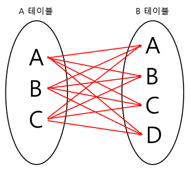

# JOIN


두개이상의 테이블이나 데이터베이스를 연결하여 데이터를 검색하는 방법이다. 
자신이 검색하고 싶은 컬럼이 다른 테이블에 있을 경우 주로 사용하며 여러 개의 테이블을 마치 하나의 테이블인 것처럼 활용하는 방법이다.

## JOIN의 종류
1. INNER JOIN
2. LEFT OUTER JOIN
3. RIGHT OUTER JOIN
4. FULL OUTER JOIN
5. CROSS JOIN
6. SELF JOIN

### PERSON


### ADDRESS


## INNER JOIN


단순히 말해서 교집합을 구한다고 생각하면 된다.

```sql
SELECT * FROM 테이블1    
INNER JOIN 테이블2
ON 테이블1.컬럼 = 테이블2.컬럼;
```


```sql


## LEFT OUTER JOIN


왼쪽 테이블을 기준으로 오른쪽 테이블과 비교하여 교집합을 구한다.

```sql
SELECT * FROM 테이블1
LEFT JOIN 테이블2
ON 테이블1.컬럼 = 테이블2.컬럼;
```


## RIGHT OUTER JOIN


오른쪽 테이블을 기준으로 왼쪽 테이블과 비교하여 교집합을 구한다.

```sql
SELECT * FROM 테이블1
RIGHT JOIN 테이블2
ON 테이블1.컬럼 = 테이블2.컬럼;
```


## FULL OUTER JOIN


두 테이블의 합집합을 구한다.

```sql
# MSSQL

SELECT * FROM 테이블1
FULL JOIN 테이블2
ON 테이블1.컬럼 = 테이블2.컬럼;

# MYSQL

SELECT * FROM 테이블1
LEFT JOIN 테이블2
ON 테이블1.컬럼 = 테이블2.컬럼
UNION
SELECT * FROM 테이블1
RIGHT JOIN 테이블2
ON 테이블1.컬럼 = 테이블2.컬럼;
```


## CROSS JOIN


두 테이블의 모든 행을 조인한다.

```sql
SELECT * FROM 테이블1
CROSS JOIN 테이블2;
```


## SELF JOIN


자기 자신과 조인하는 것을 말한다.

```sql
SELECT * FROM 테이블1
SELF JOIN 테이블1
ON 테이블1.컬럼 = 테이블1.컬럼;
```

## 질문

1. Left Join과 Right Join
2. MSSQL과 MYSQL의 FULL OUTER JOIN 차이
3. SELF JOIN의 사용 예시를 한가지 들어주세요