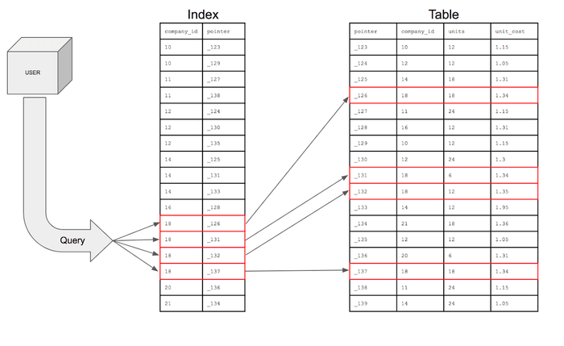

# 인덱스

- 추가적인 쓰기 작업 및 저장 공간을 활용하여 데이터베이스 테이블의 검색 속도를 향상시키기 위한 자료 구조

    

## 인덱스를 사용하는 이유

- SELECT, UPDATE, DELETE 성능 향상

    - UPDATE, DELETE 실행 시 데이터를 조회해야 하기 때문에 성능이 같이 향상됨

- 시스템의 부하 감소 (전체 테이블 조회 X)

## 인덱스의 단점

- 인덱스 관리를 위한 DB의 약 10% 정도의 저장 공간 필요

- 인덱스를 관리하기 위한 추가 작업 필요

- 잘못 하용할 경우 성능 저하

## 인덱스 관리

- 인덱스는 항상 정렬된 상태를 유지해야 값을 빠르게 찾을 수 있다

- 따라서 INSERT, UPDATE, DELETE 연산이 수행되는 경우 인덱스 역시 추가적인 연산이 필요함

    - INSERT: 새로운 데이터에 대한 인덱스 추가

    - UPDATE: 기존의 인덱스를 사용하지 않음 처리 후 갱신된 데이터에 대한 인덱스 추가

    - DELETE: 삭제하는 데이터의 인덱스를 사용하지 않은 처리

## 인덱스 사용하면 좋은 경우

- 규모가 큰 테이블

- INSERT, UPDATE, DELETE가 자주 발생하지 않는 레코드

- JOIN, WHERE, ORDER BY에 자주 사용되는 레코드

- 데이터의 중복이 낮은 레코드

## 인덱스의 자료 구조

### Hash Table

- Key, Value 형식으로 데이터를 저장하는 자료구조 ( O(1) )

- 빠른 데이터 검색이 필요할 때 유용

- 등호 연산에만 특화되어 있어 사용이 제한적 (부등호 연산의 경우 적합하지 않음)

### B+ tree

- 가장 많이 사용하는 인덱스 자료구조 증 하나 ( O(log n) )

- Root node, Branch node, Leaf node로 구성되는 계층적 구조

- Leaf node에만 데이터를 저장, 나머지 노드는 데이터 저장을 위한 인덱스만 저장

- Leaf node들 끼리는 Linked List로 연결되어 있어 순차 검색, 범위 검색에 유리

## Clustered Index

- 행 데이터를 해당 열로 정렬 한 후 Loot Page를 생성 (물리적으로 행을 재배열)

- 클러스터드 인덱스 미지정 시 자동으로 PK로 지정

- 물리적으로 정렬되어 있어 검색 속도는 Non-Clustered Index보다 빠르나, DML 작업은 상대적으로 느리다.

- 데이터 검색 순서: Root -> Reaf

## Non-Clustered Index

- 레코드의 원본은 정렬되지 않고 인덱스 페이지만 정렬 (별도의 장소에 인덱스 페이지 생성)

- Leaf page에 인덱스로 구성한 열를 정렬한 뒤 위치 포인터를 생성

    - 포인터: 파일 그룹 번호 + 데이터 페이지 번호 + 페이지 내 row 번호로 구성된 포인팅 정보

- 원본 데이터를 그대로 둔 상태에서 인덱스를 생성하기 때문에 상대적으로 더 용량 소모

- 검색 속도는 Clustered Index 보다 느리지만 DML 작업은 더 빠름

---

Q1. 인덱스를 사용하는 이유

Q2. 인덱스를 사용했을 때의 장점과 단점

Q3. Clustered Index와 Non-clustered Index의 차이

Reference
---
- https://mangkyu.tistory.com/96
- https://velog.io/@alicesykim95/DB-%EC%9D%B8%EB%8D%B1%EC%8A%A4Index%EB%9E%80
- https://velog.io/@sweet_sumin/%ED%81%B4%EB%9F%AC%EC%8A%A4%ED%84%B0%EB%93%9C-%EC%9D%B8%EB%8D%B1%EC%8A%A4-Clustered-Index-%EB%84%8C-%ED%81%B4%EB%9F%AC%EC%8A%A4%ED%84%B0%EB%93%9C-%EC%9D%B8%EB%8D%B1%EC%8A%A4-Non-Clustered-Index

