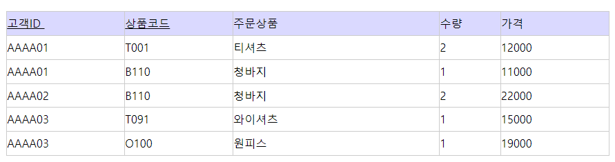
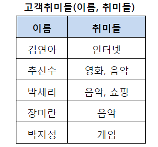
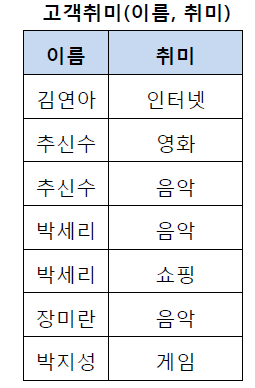
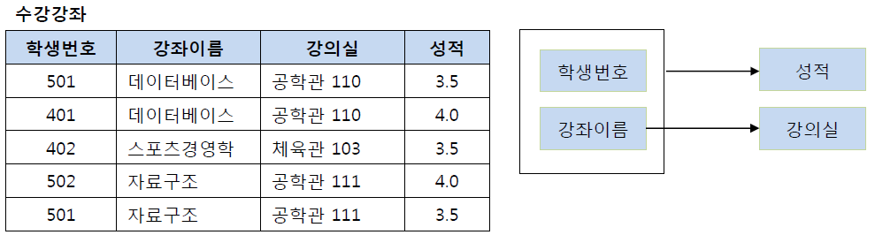
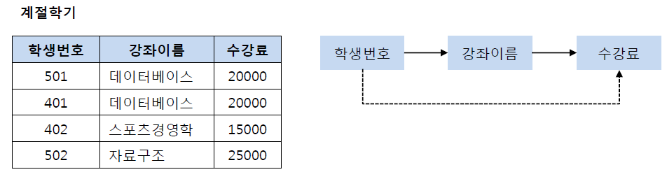
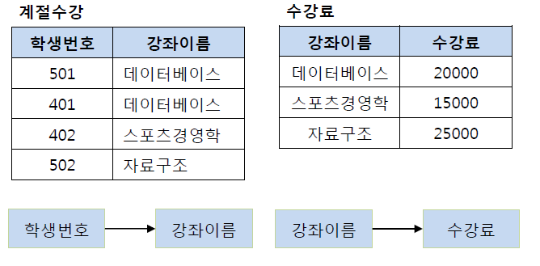
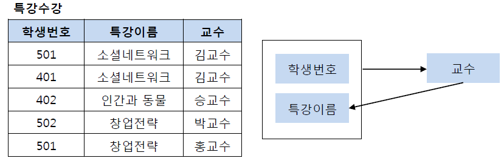
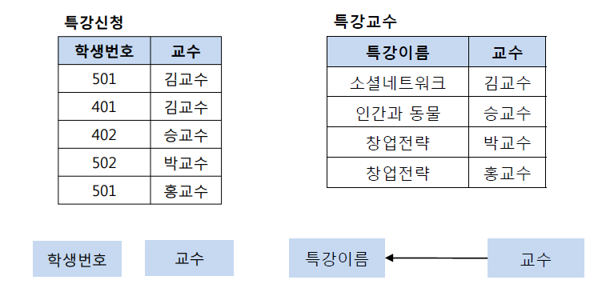

## 정규화(Normalization)

- 이상현상이 있는 릴레이션을 분해하여 이상현상을 없애는 과정
- 쉽게 말해 테이블 간에 중복된 데이터를 허용하지 않는 것
    - 무결성 유지, DB의 저장 용량을 줄일 수 있음

## *참고

### 결정자

- 어떤 attribute의 값이 다른 attribute의 값을 고유하게 결정할 수 있음
- 주어진 릴레이션에서 다른 attribute를 고유하게 결정하는 하나 이상의 attribute를 의미
- A가 B를 결정하는 결정자라고 하면 A → B로 표현

### 함수적 종속성

- 만일 attribute A가 attribute B의 결정자이면 B가 A에 함수적으로 종속한다고 말함

- 완전 함수적 종속
    - 함수적 종속 관계에서 종속자가 기본키에만 종속되며, 기본키가 여러 속성으로 구성되어 있을 경우 기본키를 구성하는 모든 속성이 포함된 기본키의 부분집합에 종속된 경우
    - (고객ID, 상품코드) → 수량
- 부분 함수적 종속
    - 릴레이션에서 종속자가 기본키가 아닌 다른 속성에 종속되거나, 기본키가 여러 속성으로 구성되어 있을 경우 기본키를 구성하는 속성 중 일부만 종속되는 경우
    - 상품코드 → 주문상품
- 이행적 함수 종속
    - 릴레이션에서 X, Y, Z라는 3개의 속성이 있을 때 X→Y, Y→Z란 종속 관계가 있을 경우, X→Z가 성립될 때 이행적 함수 종속이라고 함

## 제 1 정규화(1NF)

- 테이블의 컬럼이 원자값(하나의 값)을 갖도록 테이블을 분해하는 것

### 규칙

- 각 컬럼이 하나의 속성만을 가져야 함
- 하나의 컬럼은 같은 종류나 타입의 값을 가져야 함
- 각 컬럼이 유일한 이름을 가져야 함
- 컬럼의 순서가 상관 없어야 함

## 제 2 정규화(2NF)

- 제 1 정규화를 진행한 테이블에 대해 완전 함수 종속을 만족하도록 테이블을 분해하는 것
    - 완전 함수 종속 : 기본키의 부분 집합이 결정자가 되면 안됨

### 규칙

- 제 1 정규화를 만족해야 함
- 모든 컬럼이 부분적 종속이 없어야 함 (모든 컬럼이 완전 함수 종속을 만족해야 함)

- 이 테이블의 기본키는 (학생번호, 강좌이름)으로 복합키
- (학생번호, 강좌이름)인 기본키는 성적을 결정
- 기본키의 부분집합인 강좌이름은 강의실을 결정
- 즉, 기본키의 부분키인 강좌이름이 결정자

## 제 3 정규화(3NF)

- 제 2 정규화를 진행한 테이블에 대해 이행적 종속을 없애도록 테이블을 분해하는 것
    - 이행적 종속 : A→B, B→C가 성립할 때, A→C가 성립되는 것

### 규칙

- 제 2 정규화를 만족해야 함
- 기본키를 제외한 속성들 간의 이행 종속성이 없어야 함

- 위 테이블에서 학생 번호는 강좌 이름을 결정하고 있고, 강좌 이름은 수강료를 결정하고 있음
- 즉, 학생 번호를 알면 수강료를 알 수 있음

### 이행적 종속을 제거하는 이유?

- 501번 학생이 수강하는 강좌가 스포츠 경영학으로 변경되었다고 가정
- 이행적 종속이 존재한다면 501번의 학생은 스포츠 경영학이라는 수업을 2만원이라는 수강료로 듣게 됨
- 물론 강좌 이름에 맞게 수강료를 다시 변경할 수도 있으나 이런 번거로움을 해결하기 위해 제 3 정규화를 하게 됨
- 즉, 학생 번호를 통해 강좌 이름을 참조하고, 강좌 이름으로 수강료를 참조하도록 테이블을 분해해야 함

## BCNF 정규화

- 제 3 정규화를 진행한 테이블에 대해 모든 결정자가 후보키가 되도록 테이블을 분해하는 것

- 위 테이블의 기본키는 (학생번호, 특강이름)
- 기본키는 교수를 결정
- 교수는 특강 이름을 결정
- 문제는 교수가 특강 이름을 결정하는 결정자이지만 후보키가 아님

### 정규화의 장점

- 데이터베이스 변경 시 이상 현상(Anomaly)을 제거할 수 있음
- 정규화된 데이터베이스 구조에서는 새로운 데이터 형의 추가로 인한 확장시 그 구조를 변경하지 않아도 되거나 일부만 변경해도 됨
- 데이터베이스와 연동된 응용 프로그램에 최소한의 영향만을 미치게 되어 응용프로그램의 생명을 연장시킴

### 정규화의 단점

- 릴레이션의 분해로 인해 릴레이션 간의 JOIN 연산이 많아짐
- 질의에 대한 응답시간이 느려질수도 있음
    - 데이터의 중복 속성을 제거하고 결정자에 의해 동일한 의미의 일반 속성이 하나의 테이블로 집약되므로 한 테이블의 데이터 용량이 최소화 됨
    - 따라서 데이터를 처리할 때 속도가 빨라질 수도 있고 느려질 수도 있음
- JOIN이 많이 발생하여 성능 저하가 나타나면 반정규화(De-normalization)를 적용할 수도 있음

---

## 질문

1. 정규화란?
2. 결정자의 의미와 표현 방법은?
3. 제 3 정규화에서 이행적 종속을 제거하는 이유는?

## 참고

https://dodo000.tistory.com/20

https://mangkyu.tistory.com/110

https://superohinsung.tistory.com/111
