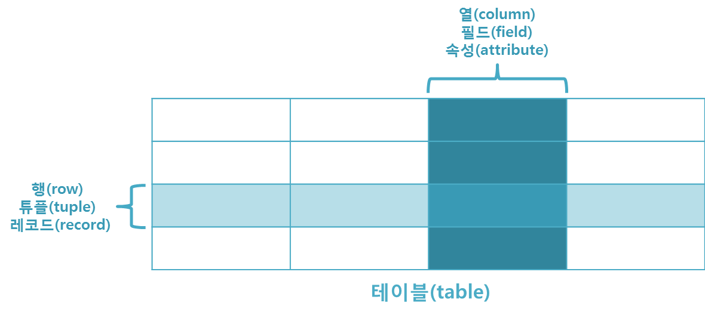

## 관계 데이터 모델

- MySQL, MariaDB, Oracle Database 등
- 데이터가 key와 value의 관계를 나타내는 테이블로 이루어져 있음
- 관계형 데이터베이스의 테이블 구성

### 기본 용어

- 릴레이션(relation) : 2차원 테이블
- 레코드(record) : 릴레이션의 각 행
- 투플(tuple) : 레코드를 좀 더 공식적으로 부르는 용어
- 속성(attribute) : 릴레이션에서 이름을 가진 하나의 열

- 도메인(domain)
    - 한 속성에 나타날 수 있는 값들의 집합
    - 프로그래밍 언어의 데이터 타입과 유사함
- 차수(degree) : 한 릴레이션에 들어있는 속성들의 수
- 카디널리티(cardinality) : 릴레이션의 투플 수(대응수)
    - 카디널리티는 0이 될 수 있음

## Key의 종류

- 슈퍼 키(Super Key) : 유일성을 만족하는 키
- 복합 키(Composite Key) : 2개 이상의 속성(attribute)를 사용한 키
- 후보 키(Candidate Key) : 유일성과 최소성을 만족하는 키. 기본키가 될 수 있는 후보이기 때문에 후보키라고 불림
- 기본 키(Primary Key) : 후보 키에서 선택된 키. NULL 값이 들어갈 수 없으며 기본키로 선택된 attribute는 동일한 값이 들어갈 수 없음
- 대체 키(Alternate Key) : 후보 키 중에 기본 키로 선택되지 않은 키
- 외래 키(Foreign Key) : 어떤 relation간의 기본 키를 참조하는 속성. relation들 간의 관계를 나타내기 위해서 사용

### 슈퍼키(Super Key) : 유일성을 만족하는 키

- 7조라는 팀에 팀원은 4명이 있다. 이 4명을 구분할 수 있는 것은 절대 겹치지 않는 학번 일수도 있고, 주민번호일 수도 있다.
- 이름과 나이를 묶어서 하나의 속성으로 만드는 것도 가능하다. 이름과 나이를 합쳐서 7조안에서 중복만 되지 않으면 가능하기 때문이다. 이름과 나이를 합쳐서 4명을 구분할 수 있으면 슈퍼키가 될 수 있다.
- 학번과 주민번호를 묶어서 슈퍼키로 만들수도 있고, 학번과 주민번호과 이름을 합쳐서 슈퍼키로도 만들수 있고, 학번과 주민번호과 이름과 나이를 합쳐서 슈퍼키를 만들수도 있다. **어떤 속성끼리 묶던 중복값이 안나오고 서로 구별**만 할 수 있으면 된다.

### 후보키(Condidate Key) : 유일성과 최소성을 만족하는 키

- 위에서 말했듯아, 이 4명을 구분하는 슈퍼키들이 모여 있는데, **슈퍼키들 중에서 속성은 최소한의 갯수**로 4명을 구분할 수 있어야 후보키가 될 수 있다.
- 학번 슈퍼키와 주민번호 슈퍼키는 속성들이 각 1개씩 이루어져 있다. 하지만 이름+나이 슈퍼키는 이름과 나이를 묶어서 2개의 속성으로 되어 있다. 이름+나이 슈퍼키는 2개 이므로 각 1개의 속성인 주민번호와 학번 슈퍼키가 최소성을 만족한다고 할 수 있다.
- 따라서 이름+나이 슈퍼키는 갯수가 다른 것보다 많기 때문에
    
    **최소성을 만족하지 못해서 후보키가 될 수 없다.**
    

### **기본키(Primary Key) :** 후보 키에서 선택된 키

- **후보키들 중에서 하나를 선택한 키로 최소성과 유일성을 만족**하는 속성이다.
- 테이블에서 기본키는 **오직 1개**만 지정할 수 있다.
- 기본키는 **NULL 값을 절대 가질수 없고, 중복된 값을 가질 수 없다**.

### **대체키(Alternate Key) :** 후보 키 중에 기본 키로 선택되지 않은 키

- 후보키가 두개 이상일 경우 그 중에서 어느 하나를 **기본키로 지정하고 남은 후보키**들을 대체키라한다.
- 후보키로 학번과 주민번호가 뽑혔고, 둘 중에서 **기본키**는 **학번**이 되었다. 학번이 기본키가 되고 남은 후보키인 **주민번호**는 **대체키**가 될 수 있다. 학번 기본키가 없어지게 되면 주민번호는 없어진 기본키를 대체할 수 있게된다.

### **외래키(Foreign Key) :** 어떤 relation간의 기본 키를 참조하는 속성

- 참조 될 테이블(A)이 먼저 만들어지고 참조하는 테이블(B)에 값이 입력되어야 한다.
- 이때, **참조될(A) 열의 값은 참조될(A) 테이블에서 기본키(Primary Key)로 설정**되어 있어야한다.
- 외래키는 참조되는 테이블의 **기본키와 동일한 키 속성**을 가진다.
- 참조되는 부모테이블이 먼저 생성된 뒤 데이터를 넣고, 참조하는 자식 테이블이 다음에 생겨야된다.
- 부모 테이블 먼저 삭제될 수 없다. 왜냐하면 부모테이블을 참조하는데 부모테이블이 삭제되면 자식테이블은 참조하는 것이 없어지기 때문에 외래키 오류가 생긴다. 따라서 외래키 관계에서 부모테이블을 삭제하려면 **자식테이블 먼저 삭제**한 후 부모테이블을 삭제해야한다.

- 위 사진에서 **부모 테이블은 학생 테이블**이고, **자식 테이블은 수강 테이블**이다.
- 학생테이블은 학번이 기본키이자 참조되는 참조키이다.
- 수강테이블은 학번이 참조하는 키이자 외래키이다.

---

## 질문

1. key의 종류에는 무엇이 있는가?
2. 기본키(Primary Key)의 조건에는 어떤 것이 있는가?
3. 외래키(Foreign Key)에서 어떤 테이블이 먼저 삭제되어야 하고 그 이유는 무엇인가?

## 참고

[[DB] 📚 데이터베이스 키(KEY) 종류 🕵️ 정리](https://inpa.tistory.com/entry/DB-📚-키KEY-종류-🕵️-정리)
