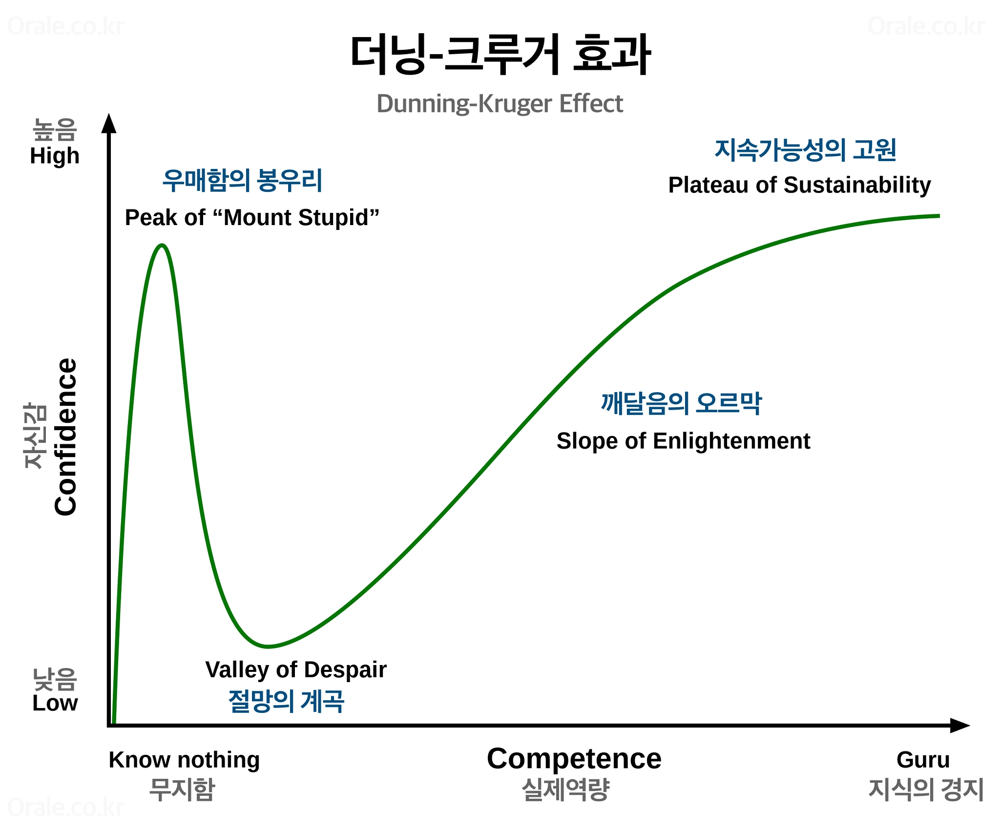

# TDD

## TDD란?
TDD란 Test Driven Development의 약자로 ‘테스트 주도 개발’이라고 한다.

반복 테스트를 이용한 소프트웨어 방법론으로 작은 단위의 테스트 케이스를 작성하고 이를 통과하는 코드를 추가하는 단계를 반복하여 구현한다.

짧은 개발 주기의 반복에 의존하는 개발 프로세스이며, 애자일 방법론 중 하나인 eXtream Programming(XP)의 ‘Test-First’ 개념에 기반을 둔 단순한 설계를 중요시한다.

이 기법을 개발했거나 ‘재발견’한 것으로 인정되는 Kent Beck은 2003년 TDD가 단순한 설계를 장려하고 자신감을 불어넣어 준다고 말하였다.

## TDD 개발 주기


1. **Red**: 실패하는 테스트를 작성한다.
2. **Green**: 테스트를 통과하는 코드를 작성한다.
3. **Refactor**: 테스트를 통과하는 코드를 리팩토링한다.

## 일반 개발 방식과 TDD 개발 방식의 비교

### 일반 개발 방식
보통 개발 방식은 ‘요구사항 분석 → 설계 → 개발 → 테스트 → 배포’의 형태의 개발 주기를 갖는다.


이러한 방식은 소프트웨어 개발을 느리게 하는 잠재적 위험이 존재한다.

그 이유는 아래와 같다.

1. 소비자의 요구사항이 처음부터 명확하지 않을 수 있다.
2. 따라서 처음부터 완벽한 설계는 어렵다.
3. 자체 버그 검출 능력 저하 또는 소스코드의 품질이 저하될 수 있다.
4. 자체 테스트 비용이 증가할 수 있다.
5. 이러한 문제점이 발생되는 이유는 어느 프로젝트든 초기 설계가 완벽하다고 말할 수 없기 때문이다.

고객의 요구사항 또는 디자인의 오류 등 많은 외부 또는 내부 조건에 의해 재설계하여 점진적으로 완벽한 설계로 나아간다.

재설계로 인해 개발자는 코드를 삽입, 수정, 삭제하는 과정에서 불필요한 코드가 남거나 중복처 될 가능성이 크다.

결론적으로 이러한 코드들은 재사용이 어렵고 관리가 어려워서 유지보수를 어렵게 만든다.

### TDD 개발 방식


TDD와 일반적인 개발 방식의 가장 큰 차이점은 테스트 코드를 작성한 뒤에 실제 코드를 작성한다는 것이다.

디자인(설계) 단계에서 프로그래밍 목적을 반드시 미리 정의해야만 하고, 무엇보다 테스트해야 할지 미리 정의(테스트 케이스 작성)해야만 한다.

테스트 코드를 작성하는 도중 발생하는 예외 사항(버그 및 수정사항)은 테스트 케이스에 추가하고 설계를 개선한다.

이후 테스트가 통과된 코드만을 코드 개발 단계에서 실제 코드로 작성한다.

이러한 반복적인 단계가 진행되면서 자연스럽게 코드의 버그가 줄어들고 소스코드는 간결해진다.

또한 테스트 케이스 작성으로 인해 자연스럽게 설계가 개선됨으로 재설계 시간이 절감된다.

## TDD의 장점

### 작동하는 깔끔한 코드로 이끈다.
TDD는 테스트를 먼저 작성한다. 그러다보니 많은 사람들이 TDD를 테스트를 잘 작성하기 위한 방법으로 오해한다. 켄트 벡이 자신의 책에서 밝혔듯이 TDD의 궁극적인 목표는 테스트가 아니라 작동하는 깔끔한 코드다.

작동하는 깔끔한 코드가 무엇인지 명확하게 정의하기는 어렵지만 우리는 직관적으로 무엇이 깔끔한 코드인지 아닌지 알고 있다. 바로 '변경이 쉬운 코드'이다. 우리는 날마다 수업이 코드를 고친다. 깔끔하지 못한 코드는 고치기 어렵다.
여기서 고치기 어렵다는 것은 여러가지 의미를 내포한다. 예를 들면 코드를 읽기 어렵다든지, 코드 중복 문제로 고쳤지만 다른 곳에서 버그를 만들거나 설계의 문제로 하나의 변경이 여러 레이어에 걸친 변경으로 이어진다든지, 코드 의도를 알 수 없다든지 등의 의미가 있을 수 있다.
작동하는 깔끔한 코드를 정의하기는 어렵지만 분명한 사실은 **변경이 쉬운 코드**라는 것이다.

테스트를 먼저 작성하는 것이 변경이 용이한 코드로 나를 이끈다는 것이다. 작동하는 깔끔한 코드로 테스트가 주도하는 것이다. 

### 느슨한 결합을 만든다.

TDD의 궁극적인 목표는 작동하는 깔끔한 코드이다. 깔끔한 코드의 핵심적인 요소로 '변경 쉬운 코드'가 있다.

느슨한 결합은 변경과 관련이 깊다. 강하게 결합되어 있으면 그만큼 변경이 어렵기 때문이다. 그런데 내가 만든 코드의 결합도가 낮은지 높은지 어떻게 알 수 있을까? 바로 테스트를 작성해보는 것이다.

> 테스트를 작성하기 쉽지 않다면, 그것은 테스트가 아니라 설계에 문제가 있다는 신호다. 결합도가 낮고 응집성이 높은 코드는 테스트하기 쉽다. -<익스트림 프로그래밍>

```java
// 테스트하기 어려운 코드
public List<Car> move() {
    cars.forEach(car -> car.move(Randoms.pickNumberInRange(RANDOM_NUMBER_RANGE_OF_MIN, RANDOM_NUMBER_RANGE_OF_MAX)));
    return cars;
}

// 테스트 코드
@Test
void moveCars() {
    //given
    Car pobiCar = Car.from("pobi");
    Car helloCar = Car.from("hello");
    Cars cars = Cars.from(List.of(pobiCar, helloCar));
    //when
    List<Car> movedCars = cars.move();
    //then
}
```

```java
// 테스트하기 쉬운 코드 
// Cars.java의 move 메서드
public List<Car> move(NumberProvider numberProvider) {
    cars.forEach(car -> car.move(numberProvider.getNumber()));
    return cars;
}

// NumberProvider.java
@FunctionalInterface
public interface NumberProvider {
    int getNumber();
}

// RandomNumberProvider.java
@Override
public int getNumber() {
    return Randoms.pickNumberInRange(RANDOM_NUMBER_RANGE_OF_MIN, RANDOM_NUMBER_RANGE_OF_MAX);
}

// 테스트 코드
@Test
void moveCars() {
    //given
    Car pobiCar = Car.from("pobi");
    Car helloCar = Car.from("hello");
    Cars cars = Cars.from(List.of(pobiCar, helloCar));
    //when
    List<Car> movedCars = cars.move(() -> 4);
    //then
    assertThat(movedCars).extracting("name", "position.value")
        .containsExactly(
            Tuple.tuple("pobi", 1),
            Tuple.tuple("hello", 1)
        );
}
```

### 잘못을 일찍 깨달을 수 있다.
분석/설계를 하며 우리는 착각한다. 문제를 알고 있다고, 이해하고 있다고. 하지만 현실은 너무나도 다르다. 심리학에서 더닝-크루거 효과라고 부른 것이 있다.

실력이 떨어지는 사람일수록 자기 평가가 부정확하게 높다는 것이다. 아는 것이 없을 때 자기 확신이 높을 가능성이 있다.



하지만 진짜 문제는 잘못 아는데서 생기는 것이 아니다. 잘못을 늦게 깨닫는 데서 생긴다. 누구나 잘못할 수 있다. 잘못을 일찍 깨달을 수 있다면 상황은 변할 수 있지만 너무 늦게 깨닫는다면 돌이킬 수 없게 되는 것이다.

잘못을 늦게 깨닫지 않으려면 빨리 써야 한다. 소프트웨어의 가치는 쓰일 때 비로소 나타나기 때문이다. 그래서 쓰임새가 중요한 것이다.

테스트 코드를 먼저 작성하는 것은 쓰임새를 정의한다는 것이고 테스트 코드를 실행한다는 것은 '쓴다'는 의미이다. 테스트는 빨리 써보게 하고 잘못 일찍 깨달을 수 있게 만든다.

### 과업을 정의하고 필요 없는 일을 개선한다.

테스트를 먼저 작성한다는 것은 프로그램이 무엇을 해야 하는지 명시적으로 정의하는 것이다.
이런 행위는 내가 무엇을 아는지와 무엇을 모르는지 인지하게 만든다. 즉, 메타인지를 높이는 것이다. 

> '아는 것에서 모르는 것으로'는 우리가 어느정도의 지식과 경험을 가지고 개발을 시작한다는 점, 개발 하는 와중에 새로운 것을 배우게 될 것임을 예상한다는 점 등을 암시한다. 이 두가지를 합쳐보자. 우리는 아는 것에서 모르는 것으로 성장하는 프로그램을 갖게 된다. 
> -<테스트 주도 개발>

모든 시스템을 만들고 오픈 전에 테스트하는 것이 아니라, 부담이 적은 작은 테스트를 자주 실행하다 보면 나중에 생기는 문제에 대한 불안을 낮출 수 있다.
또 잘 모르고 있거나 잘못 알고 있는 점을 발견하고, 그것을 바로잡는 방향으로 시간을 쓸 수 있다.

### '테스트할 시간이 없다'는 죽음의 나선에서 벗어날 수 있다.

> 스트레스를 많이 받으면 테스트를 점점 더 뜸하게 한다. 테스트를 뜸하게 하면 당신이 만드는 에러는 점점 많아질 것이다. 에러가 더 많아지면 더 많은 스트레스를 받게 된다.
> -<테스트 주도 개발>

"테스트 할 시간이 없다"고 말하는 동료의 또 다른 말이 있다.
> 포스트맨으로 테스트하고 있어요.

수동 테스트는 시간이 지나고 범위가 늘어남에 따라 인간의 인지능력의 한계와 망각으로 테스트 케이스를 모두 기억 할 수 없게 되며, 누락이 발생하기 시작한다.
게다가 코드들은 반드시 의존성을 가지기 때문에 하나를 고치면 예상하지 못하는 곳에서 오류가 발생하는 경우가 허다하다. 
따라서 모든 테스트 케이스를 수행하는 회귀 테스트를 해야 하지만, 시간 제약으로 모든 테스트 케이스를 실행해 볼 수 없어 예상치 못한 에러가 발생하는 악순환이 반복되는 것이다. 결국 코드를 신뢰할 수 없게 된다.

작동하는 코드를 만들기전에 먼저 테스트를 작성하라. 테스트를 먼저 작성함으로써 '테스트할 시간 없다'는 죽음의 나선에서 벗어날 수 있다.

---
### 참고자료
[TDD, 실패하는 테스트부터 작성해 얻는 것 5가지](https://yozm.wishket.com/magazine/detail/2308/)
[TDD란? 테스트 주도 개발](https://hanamon.kr/tdd%EB%9E%80-%ED%85%8C%EC%8A%A4%ED%8A%B8-%EC%A3%BC%EB%8F%84-%EA%B0%9C%EB%B0%9C/)
[실전에서 TDD하기](https://tech.kakaopay.com/post/implementing-tdd-in-practical-applications/)

### 질문
1. TDD의 개발 주기에 대해 설명해주세요.