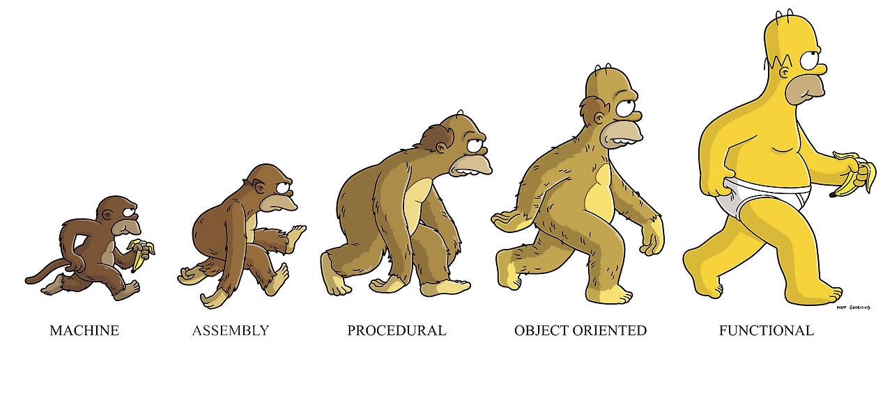

# 함수형 프로그래밍

## [ 프로그래밍 패러다임(Programming Paradigm) ]
프로그래밍 패러다임(Programming Paradigm)은 프로그래머에게 프로그래밍의 관점을 갖게 하고 코드를 어떻게 작성할 지 결정하는 역할을 한다. 
새로운 프로그래밍 패러다임을 통해서는 새로운 방식으로 생각하는 법을 배우게 되고, 이를 바탕으로 코드를 작성하게 된다.
최근의 프로그래밍 패러다임은 크게 아래와 같이 구분할 수 있다.

- 명령형 프로그래밍: 무엇(What)을 할 것인지 나타내기보다 어떻게(How) 할 건지를 설명하는 방식
  - 절차지향 프로그래밍: 수행되어야 할 순차적인 처리 과정을 포함하는 방식 (C, C++)
  - 객체지향 프로그래밍: 객체들의 집합으로 프로그램의 상호작용을 표현 (C++, Java, C#)

- 선언형 프로그래밍: 어떻게 할건지(How)를 나타내기보다 무엇(What)을 할 건지를 설명하는 방식 
  - 함수형 프로그래밍: 순수 함수를 조합하고 소프트웨어를 만드는 방식 (클로저, 하스켈, 리스프)



## [ 함수형 프로그래밍(Functional Programming)의 등장 ]
명령형 프로그래밍을 기반으로 개발했던 개발자들은 개발하는 소프트웨어의 크기가 커짐에 따라, 복잡하게 엉켜있는 스파게티 코드를 유지보수하는 것이 매우 힘들다는 것을 깨닫게 되었다.
그리고 이를 해결하기 위해 함수형 프로그래밍이라는 프로그래밍 패러다임에 관심을 갖게 되었다.
함수형 프로그래밍은 거의 모든 것을 순수 함수로 나누어 문제를 해결하는 기법으로, 작은 문제를 해결하기 위한 함수를 작성하여 가독성을 높이고 유지보수를 용이하게 해준다.
유명한 책인 클린 코드(Clean Code)의 저자 Robert C.Martin은 함수형 프로그래밍을 대입문이 없는 프로그래밍이라고 정의하였다.

그 동안 명령형 프로그래밍으로 개발을 해왔던 사람들에게 대입문이 없는 프로그래밍은 상당히 생소할 수 밖에 없다.
왜냐하면 다음과 같이 간단한 코드에서도 변수가 할당되고, 값이 대입되기 때문이다.

```java
// 1 ~ 10까지의 값이 i에 할당된다
for(int i = 1 ; i < 10; i++){
    System.out.println(i);
}
```

## [ 함수형 프로그래밍(Functional Programming)에 대한 이해 ]

앞서 설명하였든 함수형 프로그래밍은 대입문을 사용하지 않는 프로그래밍이며, 작은 문제를 해결하기 위한 함수를 작성한다고 설명하였다. 그렇기 때문에 함수형 프로그래밍에서는 위와 같은 코드를 다음과 같이 해결할 수 있다.
(아래의 코드는 실제 동작 여부와 무관하게 함수형 프로그래밍에 대한 이해를 돕기 위해 작성된 수도 코드이다.)
```
process(10,print(num));
```

process 함수는 첫 번째 인자로 몇까지 iteration을 돌 것인가를 매개변수로 받고 있고, 두 번째 인자로 전달받은 값을 출력하라는 함수를 매개변수로 받고 있다.
앞서 설명하였듯 함수형 프로그래밍은 무엇을(What)에 포커스를 두는 프로그래밍이라고 하였다.
그렇기 때문에 함수형 프로그래밍에서는 '출력을 하는 함수'를 파라미터로 넘길 수 있으며, 이는 함수형 프로그래밍의 기본 원리 中 함수를 1급 시민(First-Class Citizen) 또는 1급 객체(First-Class Object)로 관리하는 특징 때문인데, 이에 대해서는 뒤에서 자세히 설명하도록 하겠다.
명령형 프로그래밍에서는 메소드를 호출하면 상황에 따라 내부의 값이 바뀔 수 있다. 즉, 우리가 개발한 함수 내에서 선언된 변수의 메모리에 할당된 값이 바뀌는 등의 변화가 발생할 수 있다.하지만 함수형 프로그래밍에서는 대입문이 없기 때문에 메모리에 한 번 할당된 값은 새로운 값으로 변할 수 없다.

## [ 함수형 프로그래밍(Functional Programming)의 특징 ]
부수 효과가 없는 순수 함수를 1급 객체로 간주하여 파라미터나 반환값으로 사용할 수 있으며, 참조 투명성을 지킬 수 있다.

함수형 프로그래밍의 특징을 한 줄로 요약하면 위와 같다. 여기서 키워드는 "부수 효과", "순수 함수", "1급 객체", "참조 투명성" 인데, 각각에 대해 자세히 살펴보도록 하자.


### 부수효과(Side Effect)
여기서 부수효과(Side Effect)란 다음과 같은 변화 또는 변화가 발생하는 작업을 의미한다.

- 변수의 값이 변경됨
- 자료 구조를 제자리에서 수정함
- 객체의 필드값을 설정함
- 예외나 오류가 발생하며 실행이 중단됨
- 콘솔 또는 파일 I/O가 발생함

### 순수 함수(Pure Function)
그리고 이러한 부수 효과(Side Effect)들을 제거한 함수들을 순수 함수(Pure Function)이라고 부르며, 함수형 프로그래밍에서 사용하는 함수는 이러한 순수 함수들이다.

- Memory or I/O의 관점에서 Side Effect가 없는 함수
- 함수의 실행이 외부에 영향을 끼치지 않는 함수

### 순수 함수(Pure Function)의 장점
순수 함수(Pure Function)을 이용하면 얻을 수 있는 효과는 다음과 같다.

- 함수 자체가 독립적이며 Side-Effect가 없기 때문에 Thread에 안전성을 보장받을 수 있다.
- Thread에 안정성을 보장받아 병렬 처리를 동기화 없이 진행할 수 있다.

### 1급 객체(First-Class Object)
그리고 1급 객체란 다음과 같은 것들이 가능한 객체를 의미한다.

- 변수나 데이터 구조 안에 담을 수 있다.
- 파라미터로 전달 할 수 있다.
- 반환값으로 사용할 수 있다.
- 할당에 사용된 이름과 무관하게 고유한 구별이 가능하다.

함수형 프로그래밍에서 함수는 1급 객체로 취급받기 때문에 위의 예제에서 본 것 처럼 함수를 파라미터로 넘기는 등의 작업이 가능한 것이다. 또한 우리가 일반적으로 알고 개발했던 함수들은 함수형 프로그래밍에서 정의하는 순수 함수들과는 다르다는 것을 인지해야 한다.

### 참조 투명성(Referential Transparency)
마지막으로 참조 투명성(Referential Transparency)이란 다음과 같다.

동일한 인자에 대해 항상 동일한 결과를 반환해야 한다.
참조 투명성을 통해 기존의 값은 변경되지 않고 유지된다.(Immutable Data)

명령형 프로그래밍과 함수형 프로그래밍에서 사용하는 함수는 부수효과의 유/무에 따라 차이가 있다. 그에 따라 함수가 참조에 투명한지 안한지 나뉘어 지는데, 참조에 투명하다는 것은 말 그대로 함수를 실행하여도 어떠한 상태의 변화 없이 항상 동일한 결과를 반환하여 항상 동일하게(투명하게) 실행 결과를 참조(예측)할 수 있다는 것을 의미한다.
즉, 어떤 함수 f에 어떠한 인자 x를 넣고 f를 실행하게 되면, f는 입력된 인자에만 의존하므로 항상 f(x)라는 동일한 결과를 얻는다는 것을 의미한다. 부작용을 제거하여 프로그램의 동작을 이해하고 예측을 용이하게 하는 것은 함수형 프로그래밍으로 개발하려는 핵심 동기 중 하나이다. 그리고 이러한 부분인 병렬 처리 환경에서 개발할 때 Race Condition에 대한 비용을 줄여준다. 왜냐하면 함수형 프로그래밍에서는 값의 대입이 없이 항상 동일한 실행에 대해 동일한 결과를 반환하기 때문이다.

## Java를 이용한 함수형 프로그래밍(Functional Programming) 예시

어떤 단어의 리스트가 있을 때 다음과 같은 문제가 주어졌다고 하자.

단어의 크기가 2 이상인 경우를 필터링한다.
모든 단어를 대문자로 변환한다.
모든 단어를 앞글자만 잘라내어 변환한다.
모든 단어를 스페이스로 구분한 하나의 문자열로 합친다.

```java
public class WordProcessTest {

    private final List<String> words = Arrays.asList("TONY", "a", "hULK", "B", "america", "X", "nebula", "Korea");

    @Test
    void wordProcessTest() {
        String result = words.stream()
                .filter(w -> w.length() > 1) // 2글자 이상인 단어만 필터링
                .map(String::toUpperCase) // 대문자로 변환
                .map(w -> w.substring(0, 1)) // 앞글자만 잘라내어 변환
                .collect(Collectors.joining(" ")); // 스페이스로 구분한 하나의 문자열로 합침

        assertThat(result).isEqualTo("T H A N K");
    }
}
```

기존의 for 문을 사용하면 지역 변수가 필요했을 것이지만, 함수형 기반의 Stream API에서는 필요가 없다. 이를 통해 상태를 바꾸는 지역 변수 자체를 없앰으로써 부수 효과를 제거하여 의도하지 않은 문제를 해결할 수 있다.
우리가 주목해야 하는 부분은 위의 wordProcess 메소드 내부에서 filter나 map, collect 등과 같은 함수의 파라미터로 함수가 전달된다는 것이다.

---
참고자료

[[프로그래밍] 함수형 프로그래밍(Functional Programming) 이란?](https://mangkyu.tistory.com/111)

[함수형 프로그래밍](https://gyoogle.dev/blog/computer-science/software-engineering/Fuctional%20Programming.html)

질문

1. 함수형 프로그래밍의 특징은 무엇인가요?