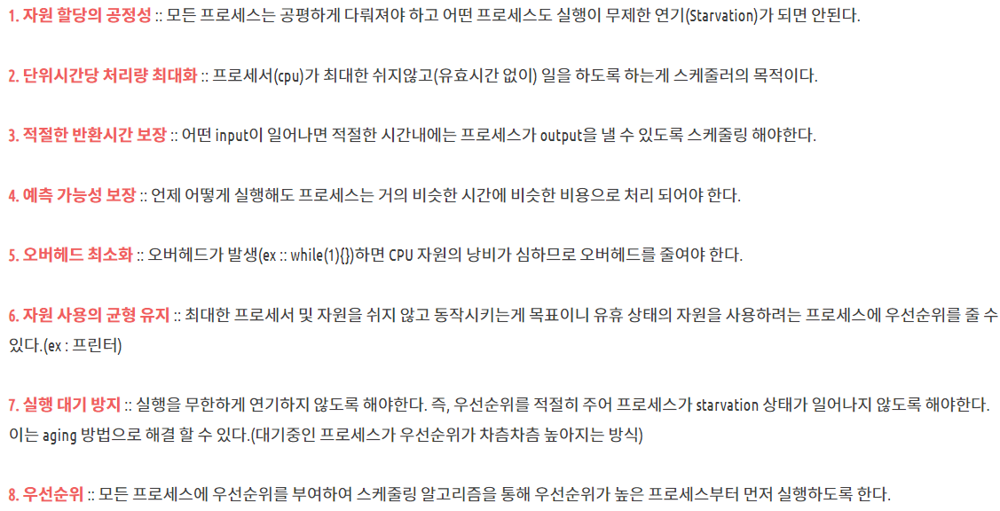
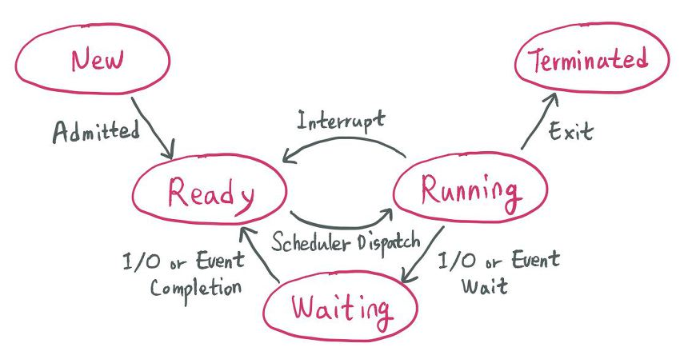
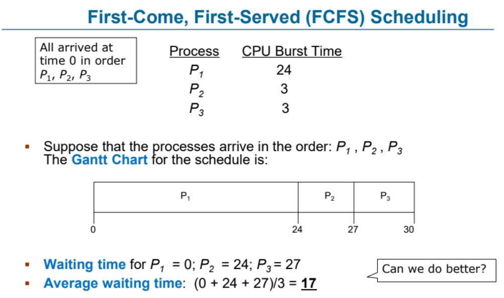
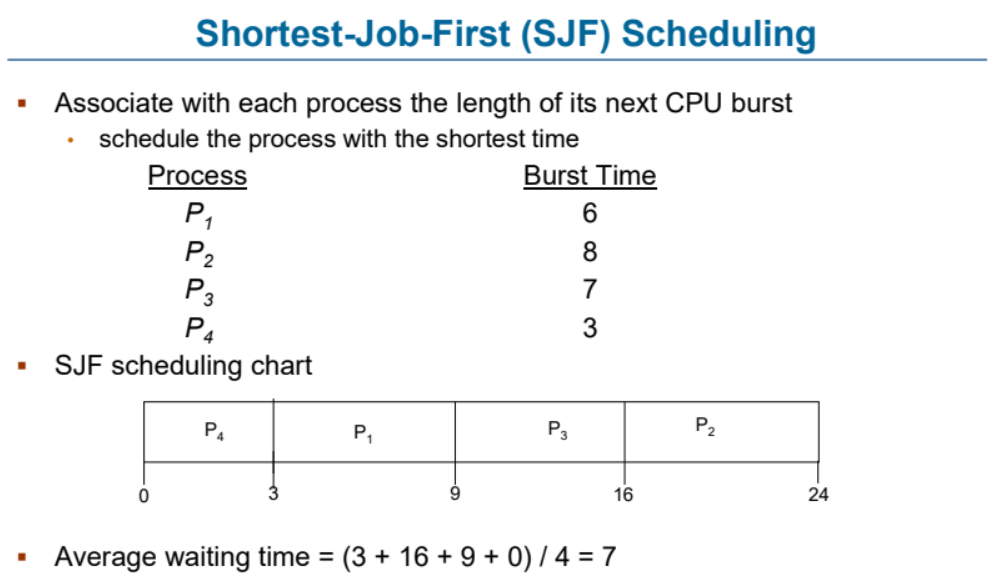
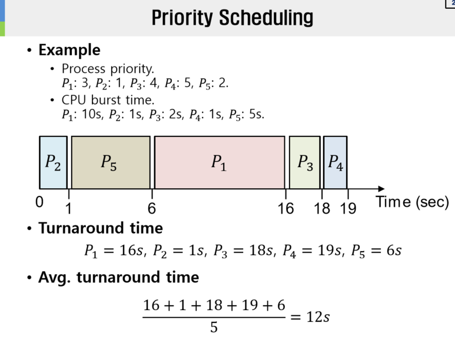
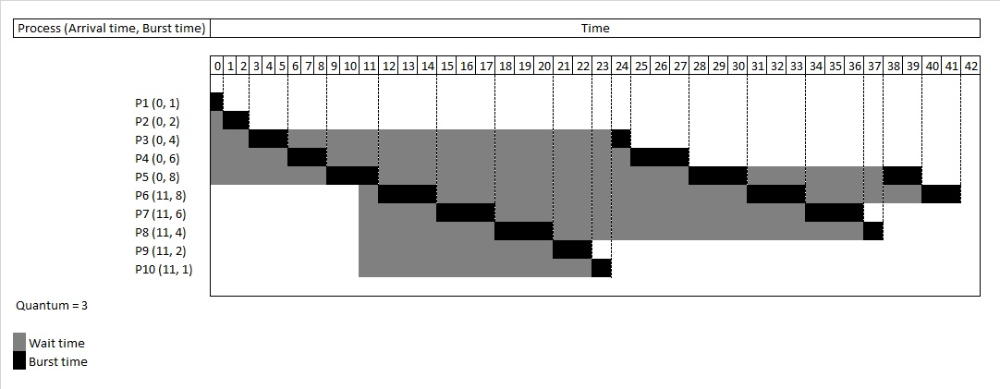
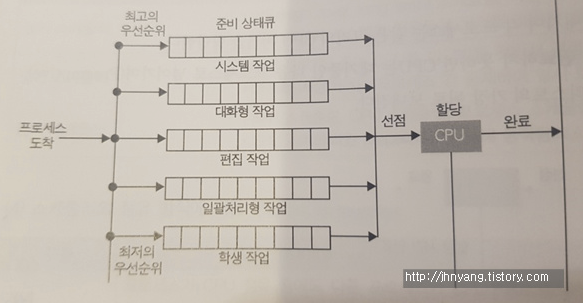
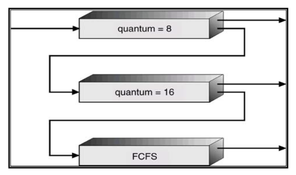
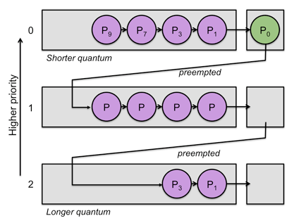

# CPU 스케줄링

## 스케줄링

 - 여러 프로세스가 번갈아가며 사용하는 자원을 어떤 시점에 어떤 프로세스에게 할당할 지 결정하는 것

 - 스케줄링 방법에 따라 CPU를 할당받을 프로세스가 결정되므로 성능에 직/간접적 영향을 미침

 - CPU의 효율성 및 프로세스의 응답 시간을 최소화
    - 작업 처리 능력 향상

## 스케줄링의 목적
 

## 스케줄링이 필요한 이유
 
 - CPU는 한번에 하나의 프로세스만 실행시킬 수 있음

 - 특정 프로세스가 CPU를 계속 점유하고 있는 경우, CPU의 효율성 감소
    - 효율성을 증가시키기 위해 CPU를 다른 프로세스에 할당 (Context Switching)

 - 입출력이나 메모리 접근과 같은 시간을 줄이고, CPU가 프로세스를 처리하는 시간을 증가

## 선점/비선점 스케줄링

 - 선점 (preemptive): OS가 CPU의 사용권을 선점하거나 강제로 회수할 수 있는 경우 (처리시간 예측 어려움)

 - 비선점 (nonpreemptive): 프로세스 종료 또는 입출력 등의 이벤트 발생시까지 실행을 보장 (처리사간 예측 용이함)

## 프로세스 상태 
 

 - Admitted: 프로세스 생성이 가능하여 승인됨.

 - Scheduler Dispatch : 준비 상태에 있는 프로세스 중 하나를 선택하여 실행시키는 것.

 - Interrupt: 예외, 입출력, 이벤트 등이 발생하여 현재 실행 중인 프로세스를 준비 상태로 바꾸고, 해당 작업을 먼저 처리하는 것.

 - I/O or Event wait: 실행 중인 프로세스가 입출력이나 이벤트를 처리해야 하는 경우, 입출력/이벤트가 모두 끝날 때까지 대기 상태로 만드는 것.

 - I/O or Event Completion: 입출력/이벤트가 끝난 프로세스를 준비 상태로 전환하여 스케줄러에 의해 선택될 수 있도록 만드는 것.

---

 - Interrupt, I/O or Event Wait/Completion, Exit: 선점 스케줄링

 - I/O or Event Wait, Exit: 비선점 스케줄링

## 스케줄링 척도

 - Response Time

    - 작업이 처음 실행되기까지 걸린 시간

 - Turnaround Time

    - 실행 시간과 대기 시간을 모두 합한 시간으로 작업이 완료될 때 까지 걸린 시간

## CPU 스케줄링의 종류

### 비선점 스케줄링

 - FCFS (First Come First Served)

    - 큐에 도착한 순서대로 CPU 할당

    - 실행 시간이 짧은 게 뒤로 가면 평균 대기 시간이 길어짐

    

 - SJF (Shortest Job First)

    - 수행시간이 가장 짧다고 판단되는 작업을 먼저 수행

    - FCFS 보다 평균 대기 시간 감소, 짧은 작업에 유리

    

 - HRN (Hightest Response-ratio Next)

    - 우선순위를 계산하여 점유 불평등을 보완한 방법(SJF의 단점 보완)

    - 우선순위 = (대기시간 + 실행시간) / (실행시간)

    

### 선점 스케줄링 

 - Priority Scheduling

    - 정적/동적으로 우선순위를 부여하여 우선순위가 높은 순서대로 처리

    - 우선 순위가 낮은 프로세스가 무한정 기다리는 Starvation 이 생길 수 있음

    - Aging 방법으로 Starvation 문제 해결 가능

    - 우선 순위가 전부 동일한 경우, FCFS와 동일

    

 - Round Robin

    - FCFS에 의해 프로세스들이 보내지면 각 프로세스는 동일한 시간의 Time Quantum 만큼 CPU를 할당 받음

    - Time Quantum or Time Slice : 실행의 최소 단위 시간

    - 할당 시간(Time Quantum)이 크면 FCFS와 같게 되고, 작으면 Context Switching이 잦아져 오버헤드 증가

    

 - Multilevel-Queue

    - Task를 그룹으로 나누어 여러 개의 Queue를 활용하는 방법

        

    - 우선순위가 낮은 큐들이 실행 못하는 걸 방지하고자 각 큐마다 다른 Time Quantum을 설정 해주는 방식 사용

    - 우선순위가 높은 큐는 작은 Time Quantum 할당. 우선순위가 낮은 큐는 큰 Time Quantum 할당

- Multilevel-Feedback-Queue

    - 다단계 큐에서 자신의 Time Quantum을 다 채운 프로세스는 밑으로 내려가고 자신의 Time Quantum을 다 채우지 못한 프로세스는 원래 큐 그대로

    - Time Quantum을 다 채운 프로세스는 CPU burst 프로세스로 판단하기 때문

    - 짧은 작업에 유리, 입출력 위주(Interrupt가 잦은) 작업에 우선권을 줌

    - 처리 시간이 짧은 프로세스를 먼저 처리하기 때문에 Turnaround 평균 시간을 줄여줌

  
  
  

## Question

    1. CPU 스케줄링의 목표는?

    2. 선점 스케줄링과 비선점 스케줄링의 차이점은?

    3. Multi-level Feedback Queue에서 Time Quantum을 다 채운 프로세스를 아래 Queue로 넘겨주는 이유는?

## Reference

 - https://www.crocus.co.kr/1373

 - https://gyoogle.dev/blog/computer-science/operating-system/CPU%20Scheduling.html

 - https://velog.io/@chappi/OS%EB%8A%94-%ED%95%A0%EA%BB%80%EB%8D%B0-%ED%95%B5%EC%8B%AC%EB%A7%8C-%ED%95%A9%EB%8B%88%EB%8B%A4.-5%ED%8E%B8-%EC%8A%A4%EC%BC%80%EC%A4%84%EB%A7%812-%EB%B9%84%EC%84%A0%EC%A0%90%ED%98%95-%EC%8A%A4%EC%BC%80%EC%A4%84%EB%A7%81-%EC%95%8C%EA%B3%A0%EB%A6%AC%EC%A6%98FCFS-SJF-HRN

 - https://gwpaeng.tistory.com/109

 - https://velog.io/@infoqoch/CPU-%EC%8A%A4%EC%BC%80%EC%A4%84%EB%A7%81%EC%9D%B4%EB%9E%80
