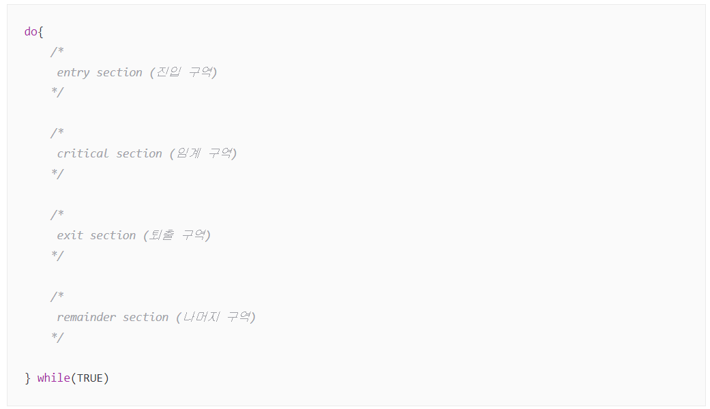
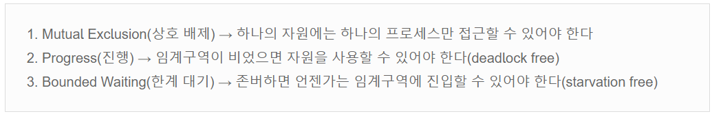
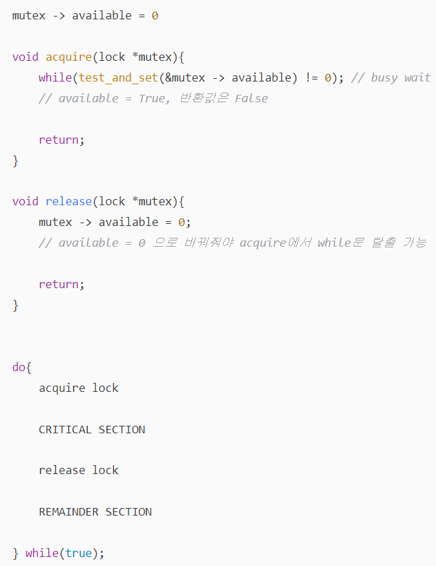

# Race Condition (경쟁 상태)

## Race Condition란?

 

 - 두 개 이상의 프로세스가 공통 자원을 병렬적으로 접근하려할 때 (read & write), 데이터에 접근한 순서에 따라서 실행 결과가 같지 않고 달라지는 상황

 - Race: 경쟁하는 상태 (여러 개의 쓰레드가 하나의 자원을 놓고 사용하기 위해 경쟁하는 것을 뜻함)

    

## 문제점

 - 결과의 예측 불가능

 - 일관성 손실

 - 디버깅 어려움 & 대기 시간 증가

## 원인

 - 커널 작업 간 인터럽트 발생 시

 - 프로세스가 커널 모드 진입 후 작업 간 Context Switching 발생 시

 - 멀티 프로세스 환경에서 공유 메모리 데이터 접근 시

## 해결 방법

### Synchronization (동기화)

 - 쓰레드의 순차적 실행을 보장

 - Critical Section에 대해서 Mutual exclusion을 보장함으로서 동기화를 유지

    - Critical Section (임계 구역): Race Condition이 발생할 수 있는 구역

        

    - 3가지 요구조건

        

    - Mutual Exclusion (상호 배제): 하나의 자원에는 하나의 프로세스만 접근 가능 

 - Peterson's Solution (SW)

 - Mutex Lock (HW)

 - Semaphore

 - etc) 공유 데이터를 최소화하여 병렬 처리 설계, Thread Safe, Test ...

## Peterson's Solution (SW)

 

 

 - Deadlock & Bounded Wait 위반

 - 이를 해결하기 위한 방법

    

 - not_turn에 대응하는 프로세스는 오직 하나

 - 프로세스가 오직 2개인 경우에만 적용 가능

 - Busy Waiting 문제 발생
 
    - Critical Section에서 대기중인 프로세스가 작업을 완료하기 전까지 CPU를 계속 점유하는 현상 (Context Switching 지속적 발생)

## Mutex Lock (HW)

### TestAndSet

 - 원자적 실행 단위 보장

    

    

 - Bounded Waiting 문제 발생

    - 프로세스의 도착 순서를 고려하지 않기 때문

 - 프로세스 도착 순서를 직접 구현하는 것은 복잡한 방법이기 때문에 API 형태의 Mutex Lock을 사용

### Mutex Lock

 - acquire(), release()를 통해 구현

 - 하드웨어로 구현 & 원자적 실행

    

 - 여전히 Busy waiting 문제 존재

## Semaphore

 

 - 자원의 수 + 대기 순서

 - 자원의 개수에 따라 Binary/Counting Semaphore로 구분

 - 대기중인 프로세르를 wait state로 보냄 (Block & Wakeup)

 ### Binary Semaphore

 - 자원의 개수가 하나인 경우

    

 ### Counting Semaphore

 - 자원의 개수가 여러 개 인 경우

 - 임계 구역의 진입 가능한 프로세스도 여러 개

      

 ### Busy Waiting (Spin lock) vs Block & Wakeup

 - Critical Section이 짧고, 프로세스가 적은 경우: Busy Waiting 유리

 - Critical Section이 길고, 프로세스가 많은 경우: Block & Wakeup 유리

 ### 단점 

- Deadlock & Starvation

    

 - Priority Inversion (우선순위 역전)

    

     - PIP(Priority Inheritance Protocol)로 해결

        

Question
---
Q1. 경쟁 상태란

Q2. 경쟁 상태를 해소하기 위한 방법 3가지와 각각의 간단한 설명

Q3. Busy Waiting과 Block&Wakeup의 차이와 각각의 방법이 유리한 경우

Reference
---
 - https://iredays.tistory.com/125
 - https://charles098.tistory.com/88
 - https://charles098.tistory.com/91
 - https://charles098.tistory.com/92
 - https://charles098.tistory.com/95
 - https://velog.io/@yarogono/CS-Race-condition%EC%9D%B4%EB%9E%80
