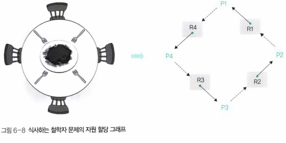
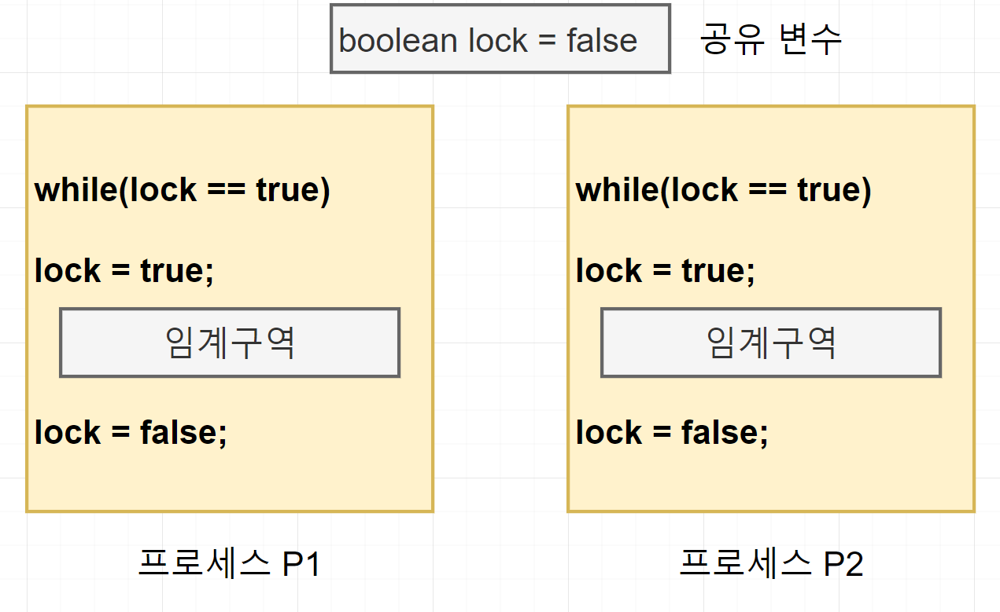

# 데드락(교착상태)

## 교착 상태의 정의

- 2개 이상의 작업이 동시에 이루어지는 경우, 다른 작업이 끝나기만 기다리며 작업을 더 이상 진행하지 못하는 상태
- 식사하는 철학자 예시

> 철학자 4명이 둥근 식탁에 둘러앉아 식사를 하는데 왼쪽에 있는 포크를 잡은 뒤 오른쪽에 있는 포크를 잡아야만 식사가 가능하다는 조건이 있다. 철학자들은 음식을 먹기 위해 왼쪽의 포크를 잡은 뒤 오른쪽 포크를 잡으려고 옆을 볼 것이다. 하지만 옆에는 포크가 아닌 포크를 들고 있는 다른 철학자가 앉아있다. 결국 모든 철학자는 오른쪽 포크를 잡지 못해 굶어죽게 된다.
> 

## 교착상태가 발생하는 경우

### 시스템 자원을 사용할 때

- 다른 프로세스와 공유할 수 없는 자원을 사용할 때 발생

### 잠금을 사용할 때

- 임계구역 문제를 해결하기 위해 잠금을 구현했는데, 무한 대기를 막지 못해 교착 상태가 발생한 경우

## 교착 상태 필요 조건

- 교착상태는 상호배제, 비선점, 점유와 대기, 원형 대기를 동시에 충족해야 발생한다.

### 상호 배제

- 한 프로세스가 사용하는 자원은 다른 프로세스와 공유할 수 없는 배타적인 자원이여야 한다.
- 동시에 사용할 수 없는 자원이여야 한다.

### 비선점

- 한 프로세스가 사용 중인 자원은 중간에 다른 프로세스가 빼앗을 수 없는 비선점 자원이어야 한다.

### 점유와 대기

- 프로세스가 어떤 자원을 할당받은 상태에서 다른 자원을 기다리는 상태여야 한다.
- 프로세스는 적어도 하나의 자원을 할당받고 있어야 한다.

### 원형 대기

- 점유와 대기를 하는 프로세스 간의 관계가 원을 이루어야 한다.
- 점유와 대기를 하는 프로세스들이 서로 방해하는 방향이 원을 이루면 프로세스들이 서로 양보하지 않기 때문에 교착상태에 빠짐

## 교착 상태 해결 방법

- 교착 상태를 해결하는 방법은 예방, 회피, 검출과 회복이 있다.

### 예방

- 교착 상태 필요조건을 만족하지 않게 만든다.
- 실효성이 적어 잘 사용되지 않는다

### 회피

- 자원 할당량을 조절하는 방법
- 자원을 할당하다가 교착상태를 유발할 가능성이 있다고 판단되면 자원할당을 중단하고 지켜보는 방식
- 예측하기가 힘들어 잘 사용되지 않는다.

### 검출과 회복

- 자원 할당 그래프를 모니터링 하면서 교착상태가 발생하는지 살펴보는 방식.
- 교착 상태가 발생하면 회복 단계가 진행됨

## 교착 상태 예방

### 상호 배제 예방

- 시스템 내에 있는 독점적으로 사용할 수 있는 자원을 없애버리는 방식
- 시스템 내의 모든 자원을 공유할 수 있으면 교착상태가 발생하지 않는다
- 단점 : 현실적으로 불가능. 현실적으로 상호 배제를 적용하여 보호해야 하는 자원이 있다.

### 비선점 예방

- 모든 자원을 빼앗을 수 있도록 만드는 방식
- 단점
    - 임계구역을 보호하기 위해 잠금을 사용하면 자원을 빼앗을 수 없음
    - 아사 문제 발생

### 점유와 대기 예방

- 프로세스가 자원을 점유한 상태에서 다른 자원을 기다리지 못하게 하는 방법
- 프로세스가 작업을 시작할 때 자신이 사용하려는 모든 자원을 한꺼번에 점유해야하고, 그렇지 못하면 자원을 모두 반납해야한다.
- 단점
    - 프로세스가 자신이 사용하는 모든 자원을 자세히 알기 어렵다 : 추가로 필요한 자원
    - 자원의 활용성이 떨어진다 : 당장 사용하지 않는 자원
    - 많은 자원을 사용하는 프로세스가 적은 자원을 사용하는 프로세스보다 불리하다
    - 결국 일괄 작업 방식으로 동작한다.

### 원형 대기 예방

- 점유와 대기를 하는 프로세스들이 원형을 이루지 못하도록 막는 방법
- 자원을 한 방향으로만 사용하도록 설정하는 방식
- 모든 자원에 숫자를 부여하고 숫자가 큰 방향으로만 자원을 할당
- 단점
    - 프로세스 작업 진행에 유연성이 떨어진다
    - 자원에 번호를 부여하기 어렵다 : 큰 번호의 자원을 사용한 후에는 작은 번호의 자원을 사용할 수 없다.

## 교착 상태 회피

### 개념

- 프로세스에 자원을 할당할 때 어느 수준 이상의 자원을 나누어주면 교착 상태가 발생하는지 파악하여 그 수준 이하로 자원을 나누어 주는 방식
- 자원의 수를 조절하여 교착 상태를 피하는 방식
- 예방과 달리 시스템의 운영 방식에 변경을 가하지 않아 더 유연한 방식
- 자원의 수와 교착 상태의 관계?
    - 시스템에 총 20개의 자원이 있다고 가정했을 때, 1개의 자원을 할당하면 교착 상태가 발생하지 않는다(점유와 대기)
    - 하지만 20개의 자원을 모두 할당하면 교착 상태가 발생할 확률이 매우 높아진다.
    - 즉, 자원을 많이 할당할수록 교착 상태가 발생할 확률이 커진다.
- 자원의 총 수와 현재 할당된 자원의 수를 기준으로 시스템을 안정상태와 불안정 상태로 나누고 시스템이 안정상태를 유지하도록 자원을 할당한다.
- 안정 상태를 유지할 수 있는 범위 내에서 자원을 할당함으로써 교착 상태를 피함

### 대표적인 구현 방법 : 은행원 알고리즘

- 은행에서 대출 금액이 가능한 범위 내이면(안정한 상태이면) 대출이 허용되지만 그렇지 않으면 거부되는 방식과 유사

| 변수 | 설명 |
| --- | --- |
| 전체 자원 | 시스템 내 전체 자원의 수 |
| 가용 자원 | 시스템 내 현재 사용할 수 있는 자원의 수   가용 자원 = 전체 자원 - 모든 프로세스의 할당 자원 |
| 최대 자원 | 각 프로세스가 선언한 최대 자원의 수 |
| 할당 자원 | 각 프로세스에 현재 할당된 자원의 수 |
| 기대 자원 | 각 프로세스가 앞으로 사용할 자원의 수   기대 자원 = 최대 자원 - 할당 자원 |
- 자원 할당 기준
    - 각 프로세스의 기대자원과 비교하여 가용 자원이 하나라도 크거나 같으면 자원을 할당
        - 가용 자원이 기대 자원보다 크다는 것은 그 자원을 사용하여 작업을 끝낼 수 있는 프로세스가 있다는 의미이므로 안정상태
    - 가용 자원이 어떤 기대 자원보다도 크지 않으면 자원을 할당하지 않음
        - 가용 자원을 사용하여 작업을 마칠 수 있는 프로세스가 없다는 의미이므로 불안정 상태

<aside>
💡

안정 상태

각 프로세스의 기대 자원과 비교하여 가용 자원이 크거나 같은 경우가 한 번 이상인 경우

</aside>

### 문제점

- 프로세스가 자신이 사용할 모든 자원을 미리 선언해야 한다
- 시스템의 전체 자원수가 고정적이어야 한다 : 현실에서는 고장이나 자원 추가로 자원수가 유동적
- 자원 낭비 : 모든 불안정 상태가 교착상태가 되는 것이 아님에도 자원을 할당하지 않음

## 교착 상태 검출

- 타임아웃, 자원할당 그래프를 이용해 검출하는 방식이 있다.

### 타임아웃

- 일정 시간 동안 작업이 진행되지 않은 프로세스를 교착 상태가 발생한 것으로 간주하여 처리하는 방법
    
    
    
- 교착 상태가 자주 발생하지 않을 것이라는 가정하에 사용하는 방법
- 장점
    - 특별한 알고리즘이 없어 쉽게 구현할 수 있다
- 단점
    - 엉뚱한 프로세스가 강제 종료될 수 있다 : 교착 상태 외의 다른 이유로 작업이 진행되지 못하는 모든 프로세스가 강제 종료될 수 있다
    - 모든 시스템에 적용할 수 없다
        - 하나의 운영체제에서는 프로세스들의 상태를 운영체제가 감시하기 때문에 가능
        - 분산되어있는 경우에는 프로세스의 응답 없음의 원인을 알기 힘들다.

### 자원 할당 그래프

- 자원 할당 그래프는 시스템 내의 프로세스가 어떤 자원을 사용하고 기다리고 있는지 보여준다
- 단일 자원을 사용하는 경우 자원 할당 그래프에 사이클이 있으면 교착 상태이다.
- 장점
    - 프로세스의 작업 방식을 제한하지 않으면서 교착상태를 정확하게 파악할 수 있다
- 단점
    - 자원 할당 그래프를 유지, 갱신, 사이클 검사하는 작업이 추가로 발생해 오버헤드가 발생한다.

## 교착상태 회복

- 교착상태가 검출되었을 때 교착 상태를 푸는 후속 작업
- 교착 상태를 유발한 프로세스를 강제로 종료한다
- 강제 종료하는 방법
    - 교착 상태를 일으킨 모든 프로세스를 동시에 종료
        - 종료 후 동시에 다시 작업을 시작하면 교착상태 재발 가능성
        - 순차적으로 실행해야하고, 이때 실행 순서의 기준을 설정해야 한다
    - 교착 상태를 일으킨 프로세스 중 하나를 골라 순서대로 종료
        - 기준
            - 우선 순위가 낮은 프로세스 먼저
            - 우선 순위가 같으면 작업 시간이 짧은 프로세스를 먼저
            - 위의 두 조건이 같으면 자원을 많이 사용하는 프로세스를 먼저 종료
- 시스템 복구가 필요하다
    - 강제 종료 전에 시스템을 복구 시켜놔야한다.
    - 시스템 복구는 명령어가 실행될 때마다 체크포인트를 만들어 가장 최근의 검사 시점으로 돌아가는 식으로 한다.

---

## 출처

**운영체제** [ 제10판 ] Abraham Silberschatz 저/ 박민규 역

**쉽게 배우는 운영체제** 조성호 저

## 질문

1. 교착상태 필요조건 4가지는?
2. 교착상태 해결 방법과 간단한 설명
3. 교착상태 검출의 두 가지 방식을 설명

    
