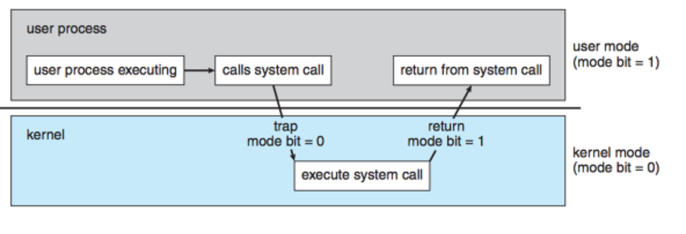

# 인터럽트

## 인터럽트란?

입터럽트는 프로그램을 실행하는 도중에 예기치 않은 상황이 발생할 경우 현재 실행중인 작업을 일시 중단하고, 발생된 상황을 우선 처리한 후 실행중이던 작업으로 복귀하여 계속 처리하는 것을 말한다.

기본적으로 CPU는 매 시점 메모리에서 명령(Instruction)을 하나씩 읽어와 수행하는데 이때마다 인터럽트가 발생했는지 확인한다. 만약 인터럽트가 발생했다면, CPU 옆에는 인터럽트 라인(Interrupt Line)이라는 것이 있어서 하던 작업을 멈추고 인터럽트와 관련된 일을 먼저 처리한다.

인터럽트가 발생하면 인터럽트 서비스 루틴(Interrupt Service Routine, ISR)이 실행되는데, 이를 인터럽트 핸들러(Interrupt Handler)라고도 한다.

인터럽트는 하드웨어 인터럽트, 소프트웨어 인터럽트, 내부 인터럽트, 외부 인터럽트, 동기적 인터럽트, 비동기적 인터럽트 등 다양한 종류가 있는데, 이 중 넓은 범위로 인터럽트를 보면 외부 인터럽트, 내부 인터럽트, 소프트웨어 인터럽트가 있다.

## 인터럽트의 종류

### 외부 인터럽트

CPU 외부에서 발생하는 인터럽트로, 하드웨어 장치나 외부 이벤트에 의해 발생한다. 주로 장치에서 CPU에 신호를 보내어 특정 작업을 처리하도록 요청한다.

- 입출력 장치 인터럽트: 키보드 입력, 마우스 클릭, 프린터의 인쇄 완료 신호 등.
- 네트워크 인터럽트: 네트워크 패킷 수신, 네트워크 장치의 이벤트 등.
- 타이머 인터럽트: 주기적인 타이머 이벤트, 시스템 클록 타이머에서 발생하는 인터럽트 등.

### 내부 인터럽트

CPU 내부에서 발생하는 인터럽트로, 주로 명령어 실행 중 오류나 예외 상황을 처리하기 위해 발생한다. 주로 트랩(Trap)이라고도 불린다.

- 예외 (Exception): 명령어 실행 중 발생하는 오류로, 0으로 나누기 오류, 잘못된 명령어 실행 등이 포함된다.
- 페이지 결함 (Page Fault): 필요한 메모리 페이지가 메모리에 없을 때 발생한다.
- 트랩 (Trap): 프로그램에서 의도적으로 발생시키는 인터럽트로, 디버깅이나 특정 요청을 처리하는 데 사용된다.

### 소프트웨어 인터럽트

소프트웨어나 프로그램에서 명시적으로 발생시키는 인터럽트로, 시스템 호출이나 특정 요청을 처리하기 위해 사용된다.

- 시스템 호출(System Call) : 사용자 프로그램이 운영체제 내부에 정의된 코드를 실행하고 싶을 때 운영체제에 서비스를 요청하는 방법이라고 볼 수 있다.

## 인터럽트 처리 과정

> 요청 → 중단 → 보관 → 인터럽트 처리 → 재개

1. 인터럽트 발생: 하드웨어나 소프트웨어가 인터럽트를 발생시킨다.

2. 인터럽트 신호 전송: 인터럽트 신호는 CPU에 전달된다. 이 신호는 CPU의 인터럽트 핀을 통해 전달되며, CPU는 이 신호를 감지하고 현재의 작업을 중단할 준비를 한다.

3. 현재 작업 상태 저장: CPU는 현재 실행 중인 프로그램의 상태(레지스터, 프로그램 카운터 등)를 스택에 저장하여, 나중에 이 작업으로 복귀할 수 있도록 한다.

4. 인터럽트 벡터 테이블 조회: CPU는 인터럽트 벡터 테이블을 조회하여, 어떤 인터럽트 서비스 루틴(ISR)이 실행되어야 하는지 확인한다. 인터럽트 벡터 테이블은 각 인터럽트 유형에 대한 주소를 매핑한 테이블이다.

5. 인터럽트 서비스 루틴(ISR) 실행: CPU는 해당 인터럽트에 대한 ISR(인터럽트 서비스 루틴)을 실행한다. ISR은 인터럽트가 발생한 원인에 따라 적절한 처리를 수행한다.

6. 상태 복원 및 복귀: ISR 실행이 완료되면, CPU는 스택에서 이전 작업의 상태를 복원하고, 중단된 프로그램으로 복귀한다. 이 과정에서 인터럽트 발생 전의 상태가 완벽하게 복원되어야 한다.

7. 프로그램 재실행: 복귀 후, 중단되었던 프로그램이 계속 실행된다.

## 만약, 인터럽트가 존재 하지 않는다면?

인터럽트가 존재하지 않는 시스템에서는 컨트롤러가 특정 작업을 수행할 시점을 알기 위해 지속적으로 상태를 체크해야 합니다. 이를 **폴링(Polling)**이라고 한다. 폴링은 주기적으로 장치나 상태를 확인하여 변화를 감지하는 방식이다.

**폴링**  
폴링 방식에서는 사용자가 명령어를 통해 입력 핀의 값을 계속 읽어 변화를 감지한다. 장치나 상태가 변화하면 그에 따라 적절한 처리를 수행한다. 하지만, 폴링 방식은 다음과 같은 단점이 있다.

- 자원 낭비: 폴링을 수행하는 동안, CPU나 컨트롤러는 계속해서 상태를 검사해야 하므로, 현재 하던 일을 수행할 수 없게 된다.
- 속도: 폴링은 인터럽트 방식에 비해 속도가 느리며, 자주 상태를 확인해야 하므로 전체 시스템 성능에 영향을 미칠 수 있다.

**인터럽트 방식**  
인터럽트 방식에서는 하드웨어가 변화를 감지하여, 변화가 있을 때만 CPU나 컨트롤러에 알림을 보낸다. 인터럽트 방식은 다음과 같은 장점을 가지고 있다.

- 효율성: 인터럽트 방식은 하드웨어가 상태 변화를 감지하고 알림을 보내기 때문에, CPU나 컨트롤러는 현재 작업에만 집중할 수 있다.
- 신속 대응: 인터럽트는 발생 시점에 즉시 반응할 수 있으므로, 실시간 처리가 필요한 상황에서 빠르게 대응할 수 있다.

인터럽트 요청을 처리하는 방법에는 여러 가지가 있으며, 그 중 두 가지 대표적인 방식은 다음과 같다.

1. Daisy Chain 방식: 인터럽트 요청을 순차적으로 처리하는 방식으로, 각 장치가 다음 장치에 신호를 전달하여 우선순위를 결정한다.
2. 병렬 우선순위 부여 방식: 모든 장치가 병렬적으로 인터럽트 요청을 보내며, CPU가 각 요청에 대해 우선순위를 부여하여 처리한다. 이 방식은 하드웨어에 의해 지원되며, 인터럽트 처리 속도가 빠르다.

인터럽트는 발생 시점을 예측하기 어려운 경우에 컨트롤러가 신속하게 대응할 수 있는 방법이다. 인터럽트 방식은 폴링 방식에 비해 시스템 자원을 보다 효율적으로 사용할 수 있으며, 실시간 처리가 필요한 상황에서 필수적인 기능이다.

## 인터럽트와 특권명령

CPU가 수행하는 명령에는 `일반 명령`과 `특권 명령`이 있다.  
`일반 명령`은 메모리에서 자료를 읽어오고, CPU에서 계산을 하는 등의 명령이고 모든 프로그램이 수행할 수 있는 명령이다.  
`특권 명령`은 보안이 필요한 명령으로 입출력 장치, 타이머 등의 장치를 접근하는 명령이다. 특권 명령은 항상 **운영체제**만이 수행할 수 있다.

### Kernel Mode / User Mode

운영체제는 하드웨어적인 보안을 유지하기 위해 기본적으로 두가지 operation을 지원한다. `kernel mode`는 운영체제가 CPU의 제어권을 가지고 명령을 수행하는 모드로 일반 명령과 특권 명령 모두 수행할 수 있다. supervisor mode, system mode, privileged mode라고도 불린다.
그러나 `user mode`는 일반 사용자 프로그램이 CPU 제어권을 가지고 명령을 수행하는 모드이기 때문에 일반 명령만을 수행할 수 있다.

위의 process가 프로그램 명령 수행중에 디스크 입출력 명령을 읽은 경우를 생각해 보자. 사용자 프로그램은 입출력 장치에 접근하는 명령을 수행할 수 없다. user mode에서 특권 명령을 수행할 수 없기 때문이다.
이련 경우에 사용자 프로그램은 운영체제에게 시스템 콜을 통해 특권명령을 대신 수행해달라고 요청한다. 시스템 콜은 소프트웨어 인터럽트로, 사용자 모드에서 커널 모드로의 전환을 통해 이루어진다.

커널 영역의 기능을 사용자 모드가 사용 가능하게, 즉 프로세스가 하드웨어에 직접 접근해서 필요한 기능을 사용할 수 있게 해준다.

CPU가 인터럽트 라인을 검사하여 인터럽트가 발생한 것을 감지하면, 현재 수행 중인 사용자 프로그램을 잠시 중단하고 CPU의 제어권을 운영체제에 넘긴다 (kernel mode로 전환). 이때 하드웨어적으로 모드 비트가 1에서 0으로 전환되어 특권 명령을 수행할 수 있게 된다. 이후 작업이 완료되면, CPU는 다시 사용자 프로그램으로 제어권을 돌려줍니다.

# 질문

1. 구글 검색창을 클릭 후, 커서가 깜빡이고 있다. 이 때, 검색창에 "Hello World!" 를 검색하면 컴퓨터 내부에서 어떤 일이 발생하는가?
2. 외부 인터럽트와 내부 인터럽트의 차이점은?
3. 인터럽트 방식이 없다면 어떤 작업이 실행되고, 단점은 무엇인가?

# 참고 자료

https://coding-hell.tistory.com/118  
https://justzino.tistory.com/4
