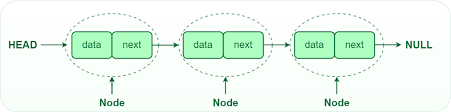

## Array


- 데이터타입 배열이름[배열길이]
- 배열을 선언함과 동시에 데이터 타입과 길이가 결정됨
- 저장할 데이터의 최대 수를 예상하기 어렵거나 길이를 가변적으로 변경해야할 필요가 있으면 적합하지 않음
- 인덱스를 통해 원하는 값을 빠르게 검색할 수 있음

## ArrayList


- ArrayList<데이터타입> 이름 = new ArrayList<데이터타입>(초기용량);
- ArrayList는 내부적으로 데이터를 배열에서 관리
- 배열에 더 이상 저장할 공간이 없으면 자체적으로 배열의 크기를 늘려 처리
- 인덱스를 통해 데이터 접근이 가능

## LinkedList



```java
class Node {
		Node* next;
		int data;
}
```

- 불연속적으로 저장된 데이터를 서로 연결한 형태로 구성되어있는 자료구조
- 각 node들은 자신과 연결된 다음 요소에 대한 주소값과 데이터로 구성되어있음
- 크기가 가변적
- 데이터가 불연속적으로 저장 → 원하는 데이터에 접근할 때 처음부터 순차적으로 검색해야 함

## 자료구조의 삽입과 삭제

|  | Array | ArrayList | LinkedList |
| --- | --- | --- | --- |
| 순차적인 데이터 추가 | 빠름 | 빠름 | 빠름 |
| 순차적인(끝에서부터) 데이터 삭제 | 빠름 | 빠름 | 빠름 |
| 비순차적인(배열의 중간) 
데이터 추가 및 삭제 | 느림 | 느림 | 빠름 |

### Array

- 중간 데이터 추가/삭제는 기존의 데이터들을 복사해서 새로운 배열에 저장하는 과정이 필요하기 때문에 속도가 느림
- 크기를 변경하려면 새로운 배열을 생성해서 데이터를 복사해야함
    - 새로운 배열 생성을 막기 위해 충분히 큰 크기의 배열을 생성하면 메모리 낭비

### ArrayList

- 순서와 관계없이 데이터를 추가하고 삭제할 수 있는 기능을 제공
    - 중간 순서 데이터 추가/삭제시 다른 데이터들이 자리를 이동해야하는 것은 Array와 동일
- 크기가 가변적이라는 점 외에는 Array와 유사

### LinkedList

- 데이터 추가 및 삭제는 이전 순서와 다음 순서의 노드만 조정해주면 되어서 빠름
- 인덱스를 통한 데이터 접근이 불가능해 추가하거나 삭제할 순서까지 접근하는데 많은 시간이 소요됨

## 질문

1. Array의 중간 삽입 속도가 느린 이유는?
2. ArrayList는 더이상 저장할 공간이 없으면 어떻게 되는가?
3. LinkedList의 단점은 무엇인가?

## 참고

[https://velog.io/@letskuku/자료구조-Array-vs-ArrayList-vs-LinkedList](https://velog.io/@letskuku/%EC%9E%90%EB%A3%8C%EA%B5%AC%EC%A1%B0-Array-vs-ArrayList-vs-LinkedList)
