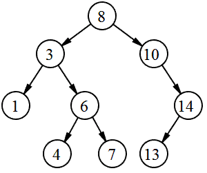
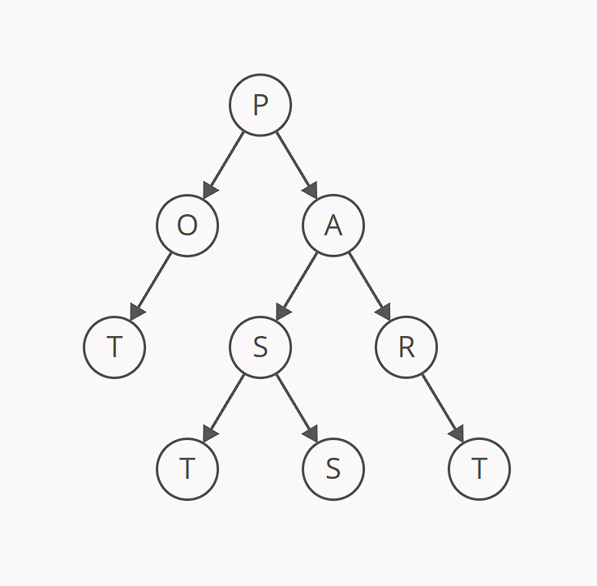
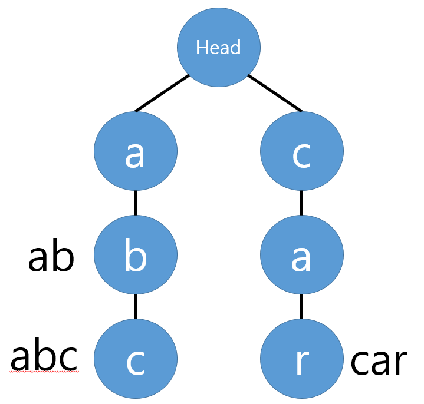
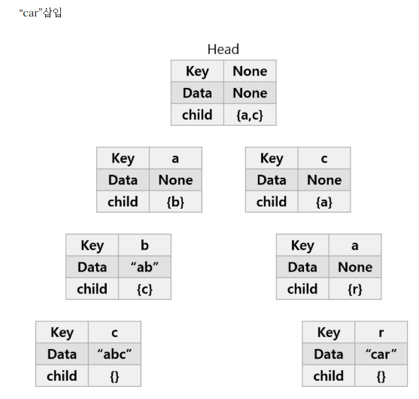
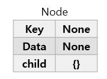

## 트라이(Trie)란?

### 트리(Tree)



- 노드와 에지로 구성되는 계층 관계를 나타내는 자료구조
- 구성 : 노드, 엣지, 루트(가장 상위 노드), 리프(가장 마지막 노드)
- 종류 : 바이너리 트리, ***트라이*** 등

### 트라이(Trie)



- retrieval(검색) tree에서 나옴
- Prefix(접두사) Tree, digital search tree, retrieval tree라고도 부름
- 문자열을 Key로 사용하는 동적인 Set 또는 연관 배열을 저장하는 트리의 확장 구조
- 문자열을 저장하고 효율적으로 탐색하기 위해 사용
- 검색할 때 볼 수 있는 자동완성 기능, 사전 검색 등에 특화되어있음

### 트라이 장단점

- 문자열 검색을 빠르게 함
- 문자열 탐색시 하나하나씩 전부 비교해서 탐색하는 것보다 시간복잡도가 낮음
- 각 노드에서 자식들에 대한 포인터들을 배열로 모두 저장하고 있기때문에 저장 공간을 많이 차지함

### 트라이 구조 : ‘abc’, ‘ab’, ‘car’를 트라이에 저장하기

- 기본적으로 data는 None으로 구성
- 단어가 끝날 때 data에 해당 단어를 저장





## 트라이 구현 - python

```python
class Node(object):
    def __init__(self, key, data=None):
        self.key = key
        self.data = data
        self.children = {}
```



```python
class Trie(object):
    def __init__(self):
        self.head = Node(None)

    # 문자열 삽입
    def insert(self, string):
        curr_node = self.head

        # 삽입할 String 각각의 문자에 대해 자식Node를 만들며 내려간다.
        for char in string:
            # 자식Node들 중 같은 문자가 없으면 Node 새로 생성
            if char not in curr_node.children:
                curr_node.children[char] = Node(char)

            # 같음 문자가 있으면 노드를 따로 생성하지 않고, 해당 노드로 이동
            curr_node = curr_node.children[char]

        # 문자열이 끝난 지점의 노드의 data값에 해당 문자열을 표시
        curr_node.data = string
        
    # 문자열이 존재하는지 탐색!
    def search(self, string):
        # 가장 아래에 있는 노드에서부터 탐색 시작한다.
        curr_node = self.head

        for char in string:
            if char in curr_node.children:
                curr_node = curr_node.children[char]
            else:
                return False

        # 탐색이 끝난 후에 해당 노드의 data값이 존재한다면
        # 문자가 포함되어있다는 뜻이다!
        if curr_node.data is not None:
            return True
```

- 생성 시간 복잡도 : O(ML)
- 탐색 시간 복잡도 : O(L)
- M : 총 문자열들의 수 / L : 제일 긴 문자열의 길이

---
## 질문

1. 트라이는 어디에 사용되는가?
2. 트라이의 장단점은?
3. 트라이의 탐색 시간 복잡도는 왜 O(L)일까?

## 참고

https://brunch.co.kr/@springboot/75

[https://velog.io/@kimdukbae/자료구조-트라이-Trie](https://velog.io/@kimdukbae/%EC%9E%90%EB%A3%8C%EA%B5%AC%EC%A1%B0-%ED%8A%B8%EB%9D%BC%EC%9D%B4-Trie)
