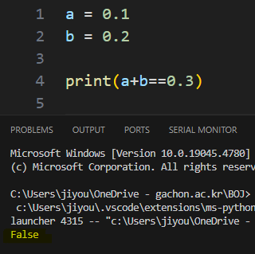
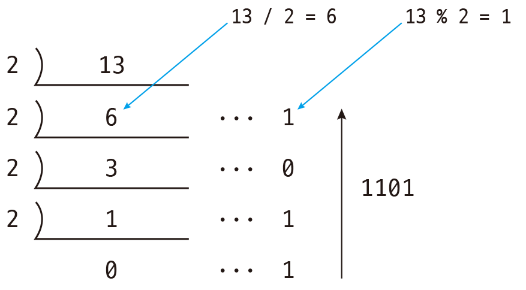
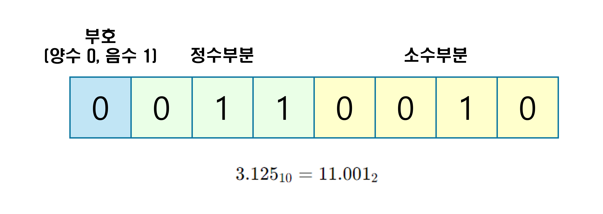
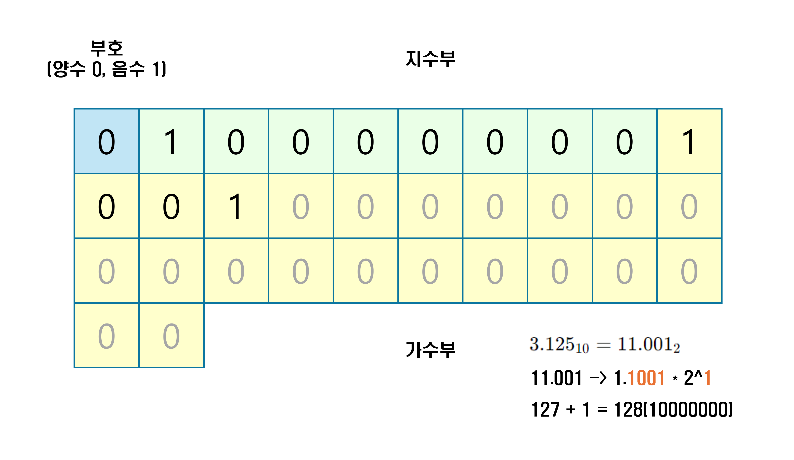

# 고정 소수점 & 부동 소수점

왜 컴퓨터는 ***‘0.1 + 0.2 ≠ 0.3’*** 라고 할까?

## 10진수를 2진수로 변환하기

### 정수의 경우

1. 10진수 정수를 2로 나누어 나머지를 적는다
2. 몫이 0이 될 때까지 반복한다
3. 나머지를 아래서부터 읽는다

### 실수의 경우

.png)

1. 10진수 실수에 2를 곱하고 정수 부분을 적는다
2. 소수 부분을 가지고 곱한 값이 1이 될 때까지 반복한다
3. 정수 부분을 위에서부터 읽는다

## 실수를 저장하는 방법

### 1. 고정 소수점 방식

- 장점 : 단순하게 표현할 수 있다.
- 한계 : 표현할 수 있는 최대 숫자가 제한된다.

### 2. 부동 소수점 방식

1. 실수를 2진수로 변환
2. 정수부분이 한자리가 되도록 소수점을 옮겨서 변환 (이동한 자리수만큼 2의 n승이 곱해짐)
3. 변환한 숫자의 2의 지수부분을 127을 더해 앞 지수부에 저장
4. 변환한 숫자의 소수점 아래 부분을 가수부에 저장

- 부동소수점 수를 표현하기 위한 여러 표준이 있음(IEEE 754)
    - 지수부와 가수부의 크기, 비율
    - 바이어스(지수에 얼마를 더해줄 것인지), 정규화(가수부의 맨 앞의 숫자를 정함)
    - 반올림 방식

## 실수 저장의 문제점

### 정밀도 손실

- 0.1을 2진수로 변환하면 0.000110011001100 …  이 무한히 반복된다.
- 정해진 영역을 벗어나는 부분을 잘라 표현하게 되기 때문에 근사값으로 저장된다.
- 잘린 부분 때문에 오차가 발생한다.

⇒ 따라서 정확도가 중요한 데이터의 경우 실수가 아닌 정수 형태로 저장한다.

---

## 질문

1. 컴퓨터에서 실수를 저장하는 형식 두 가지는 무엇인가?
2. 부동 소수점 방식에서 지수부에는 어떤 값이 들어가는가?
3. 왜 컴퓨터는 ******‘0.1 + 0.2 ≠ 0.3’ 라고 하는가?

## 참고자료

https://youtu.be/-GsrYvZoAdA

https://daldalhanstory.tistory.com/147
